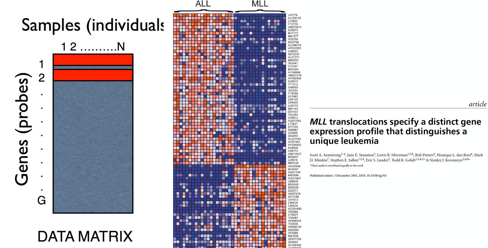

```{r setup, include=FALSE}
knitr::opts_chunk$set(echo = TRUE)
```


# What is R

What is R?  
Easy: R is a dialect of S.  

What is S?  
S is a language that was developed by John Chambers and others at the old Bell Telephone (AT&T Corp), initiated in 1976 as an internal statistical analysis environment originally implemented as Fortran libraries.  After a long path of selling and re-selling  now it is owned by the company TIBCO.   

S language had its **roots in data analysis**, did not come from a traditional programming language background. The aim is to make data analysis easier, first for themselves, and then eventually for others.
John Chambers writes: *[W]e wanted users to be able to begin in an interactive environment, where they did not consciously think of themselves as programming. Then as their needs became clearer and their sophistication increased, they should be able to slide gradually into programming, when the language and system aspects would become more important.*


In 1991, R was created by Ross Ihaka and Robert Gentleman in the Department of Statistics at the University of Auckland Ross Ihaka and Robert Gentleman. *R: A language for data analysis and graphics. Journal of Computational and Graphical Statistics, 5(3):299–314, 1996*

In 1995, Ross and Robert used the GNU General Public License⁴ to make R free software.  

In 1996, a public mailing list was created (the R-help and R-devel lists). 1997 the R Core Group was formed. In 2000 R version 1.0.0 was released to the public.

R system is available from the Comprehensive R Archive Network https://cran.r-project.org/. R system is organized in **packages**. There are also over 4000 packages on CRAN that have been developed by users and programmers around the world.There are also many packages associated with the Bioconductor project. Other packahges on personal webpages  or on repositories like GitHub.

## Download and Install R and RStudio
R: https://cran.r-project.org/  
The Integrated development enviroment (IDE) for R:
https://www.rstudio.com/products/rstudio/

# R as a calculator
Compute operations
```{r}
5+7
```
Assign value to variables
```{r}
x<- 5+7
```
R does not print the result of 12. R assumes that you don't want to see the result immediately. 
Just type x to see its value
```{r}
x
```
Assign the value of x to another variable
```{r}
y<- x-3
y
```

# Vector 
Use the function c() to combine values in a vector or lists 
‘c’ = concatenate , combine  

```{r}
c(1.1, 9, 3.14) 
```
Assign vector to varaible 
```{r}
z<- c(1.1, 9, 3.14) 
z
```

Use ?the function such as ?c to get the R's built-in help
```{r}
?c
```

Create a vector combining vectors
```{r}
c(z,555,z)
```

# R recycling values 
Numeric vectors can be used in arithmetic expression. 
R multiplied each of the three elements in z by 2. Then it added 100 to each element to get the result you see above.
```{r}
z*2+100
```
It is the same to write 
```{r}
z * c(2, 2, 2) + c(100, 100, 100)
```
Take the square root of z - 1 and assign it to a new variable called my_sqrt.
```{r}
my_sqrt <- sqrt(z-1)
```
What do you think my_sqrt contains?  
1: a vector of length 3  
2: a vector of length 0 (i.e. an empty vector)  
3: a single number (i.e a vector of length 1)  
```{r, eval = FALSE}
my_sqrt
```

When given two vectors of the same length, R simply performs the specified arithmetic operation (`+`, `-`, `*`, etc.) element-by-element. If the vectors are of different lengths, R 'recycles' the shorter vector until it is the same length as the longer vector.


```{r}
 my_div <- z/my_sqrt 
```

1: my_div is a single number (i.e a vector of length 1)  
2: The first element of my_div is equal to the first element of z divided by the first element of my_sqrt, and so on...  
3: my_div is undefined  


```{r}
c(1, 2, 3, 4) + c(0,10)
c(1, 2, 3, 4) + c(0, 10, 100)
```


# Sequences of numbers
```{r}
1:20
```
Sequence of real number
```{r The result is a vector of real numbers starting with pi (3.142...) and increasing in increments of 1. The upper limit of 10 is never reached, since the next number in our sequence would be greater than 10.}
 
pi:10
```

Decreasing sequence
```{r}
15:1
```

```{r}
seq(1,20)
seq(0, 10, by=0.5)
my_seq <-seq(5, 10, length=30) 
my_seq
```
Look at this:
```{r}
1:length(my_seq)
```
R has a separate built-in function for this purpose called seq_along()
If R has a built-in function for a particular task, it is likely that function is highly optimized for that purpose and is your best option. As you become a more advanced R programmer, you will design your own functions to perform tasks when there are no better options. We will explore writing your own functions in future lessons.
```{r}
seq_along(my_seq)
```

The function rep with aurguments times and each. Times repeats the vector (0, 1, 2) over and over again. each allows to have the output vector to contain 10 zeros, then 10 ones, then 10 twos.
```{r}
rep(0, times = 40)
rep(c(0, 1, 2), times = 10)
rep(c(0, 1, 2), each = 10)
```

# Non numeric Vector 
Above, we dealt entirely with numeric vectors, which are one type of atomic vector. Other types of atomic vectors include logical, character, integer, and complex. 

Vectors come in two different flavors: atomic vectors and lists.
An atomic vector contains exactly one data type (numeric,logical, character, integer, and complex). A list may contain multiple data types.

## Logical Vector
Logical vectors can contain the values TRUE, FALSE, and NA (for 'not available'). These values are generated as the result of logical 'conditions'. Let's experiment with some simple conditions.
```{r}
num_vect <- c(0.5, 55,-10,6) #numeric vector
tf <- num_vect < 1
```
What do you think tf will look like?  
1: a single logical value  
2: a vector of 4 logical values  

Using Logical operators : >`, `<=`, `==` ,`!=`, ‘<‘, ‘>=‘ and Union : A | B Intersection: A & B and Negation: !A

```{r}
num_vect >= 6 
log_vect <- ((111 >= 111) | !(TRUE)) & ((4 + 1) == 5)
```

## Character Vector
```{r}
my_char <- c("My", "name", "is")
my_char
```

Create one continuous character string. 
```{r}
paste(my_char, collapse = " ")
```
To concatenate the name
```{r}
my_name <- c(my_char, "Pippo")
my_name
paste(my_name, collapse=" ")
```

paste() can also be used to join the elements of multiple character vectors.
```{r}
paste("Hello", "world!", sep = " ")
paste(1:3, c("X","Y","Z"),sep="")
paste(1:3, c("X","Y","Z"),sep=" ")
```

What happen if our vectors are of different length? 
```{r}
paste(LETTERS, 1:4, sep = "-")   
```


## Missing Values
Missing values play an important role in statistics and data analysis. Often, missing values must not be ignored, but rather they should be carefully studied to see if there's an underlying pattern or cause for their missingness.

NA is used to represent any value that is 'not available' or 'missing' 
```{r} 
x<-c(44, NA, 5, NA)
x*3
```
Let's create a vector containing 1000 draws from a standard normal distribution a vector containing 1000 NAs.  Let's select 100 elements at random from these 2000 values (combining y and z) such that we don't know how many NAs we'll wind up with or what positions they'll occupy in our final vector.

```{r} 
y <- rnorm(1000)
z <- rep(NA, 1000)
my_data <- sample(c(y, z), 100)
```

 R represents TRUE as the number 1 and FALSE as the number 0
```{r} 
my_na <-  is.na(my_data)
my_na
sum(my_na)   
```

In our previous discussion of logical operators, we introduced the `==` operator as a method of testing for equality between two objects. So, you might think the expression my_data == NA yields the same results as is.na().

NA is not really a value, but just a placeholder for a quantity that is not available, infact 
```{r} 
my_data == NA  
```

another type of missing value is NaN (not a number)

```{r} 
0/0
Inf-Inf
```

# Subsetting Vectors 

Select some particular elements (i.e. a 'subset') from a vector is by placing an 'index vector' in square brackets immediately following the name of the vector.

```{r} 
#Create a vector called x that contains a random ordering of 20 numbers (from a standard normal distribution) and 20 Nas
x <- sample (c(rnorm(20), rep(NA, 20)), 40)
x
```

Subset indexing in square brackets
```{r} 
x[1:10]
```
## Indexing vector

Index vectors come in four different flavors  
logical vectors,  
vectors of positive integers  
vectors of negative integers  
vectors of character strings  

## Indexing with logical values

One common scenario when working with real-world data is that we want to extract all elements of a vector that are not NA (i.e. missing data).

Recall that is.na(x) yields a vector of logical values the same length as x, with TRUEs corresponding to NA values in x and FALSEs corresponding to non-NA values in x.

```{r, eval =FALSE} 
x[is.na(x)] 

x
```

What do you think it will give you?  
 
1: A vector of length 0  
2: A vector with no NAs  
3: A vector of all NAs  
4: A vector of TRUEs and FALSEs  

```{r} 
y<-x[!is.na(x)] 
y
```

Recall that the expression y > 0 will give us a vector of logical values the same length as y, with TRUEs corresponding to values of y that are greater than zero and FALSEs corresponding to values of y that are less than or equal to zero. 
```{r, eval=FALSE} 
y[y > 0]
```

1: A vector of TRUEs and FALSEs  
2: A vector of all NAs  
3: A vector of all the positive elements of y  
4: A vector of length 0  
5: A vector of all the negative elements of y  


Attention to use logical indices when you have NA values.
Since NA is not a value, but rather a placeholder for an unknown quantity, the expression NA > 0 evaluates to NA. Hence we get a bunch of NAs mixed in with our positive numbers when we do this.

```{r} 
x[x > 0] 
```
## Indexing with a Vector of positive integers

Subset the 3rd, 5th, and 7th elements of x
```{r} 
x[c(3,5,7)]  
```
Pay attention on idexing
```{r} 
x[3000]   #x has 40 elements
x[0]
x[1]
```

## Indexing with a Vector of negative integers

If we're interested in all elements of x EXCEPT the 2nd and 10th

```{r} 
x[c(-2, -10)] # use vector of negative index
#or
x[-c(2, 10)]
```


## Indexing with a Vector of character strings
Construct a vector with named elements
```{r} 
#a numeric vector with three named elements
vect <- c(foo = 11, bar = 2, norf = NA)
vect
```
Function names gives the names 
```{r} 
names(vect)
```

Alternatively, create an unnamed vector vect2 and add the `names` attribute to vect2 
```{r} 
vect2 <- c(11, 2, NA) 
names(vect2) <- c("foo","bar", "norf")
identical(vect,vect2)
```

Which of the following commands do you think would give us the second element of vect?  
1: vect["2"]  
2: vect[bar]  
3: vect["bar"]  
Subsetting with indexing names
```{r} 
vect[c("foo", "bar")]
```

#Factors
Data structures to represent values that can assumenre only discrete values. They are defined as discrete levels Ex: qualitative data, or ordinal data.

The factors are constructed by the factor function
```{r} 
trt <- factor(rep(c("Control","Treated"),c(3,4)))
trt
```

The feature provides a summary table  Of the frequencies of the two Control and Treated levels
```{r} 
summary(trt)
```

The factors constructed using factor with an existing array:
```{r} 
s<-c(rep("A",3),rep("T",3),rep("G",3),rep("C",3))
fs <- factor(s)
fs
```

An ordered factor is a special type of factor where the levels are ranked
```{r} 
ofs <- factor(s, ordered = TRUE)
ofs
```

# List
A R list is an object consisting of an **ordered** collection of objects known as its components 
```{r} 
Lst <- list(name="Fred", wife="Mary", no.children=3, child.ages=c(4,7,9))  #no same type
Lst
class(Lst)
```

Components are always numbered and may always be referred to as such 
Lst[[1]], Lst[[2]], Lst[[3]] and Lst[[4]]. If, further, Lst[[4]] is a vector subscripted array then Lst[[4]][1] is its first entry.


The number of its (top level) components
```{r} 
length(Lst) 
```

Components of lists may be named,
```{r} 
Lst$child.ages[1] #is the same as Lst[[4]][1]
Lst[["name"]] # is the same as Lst$name
Lst$name
Lst[[1]]
Lst[1]
```
‘[[...]]’ is the operator used to select a single element, whereas ‘[...]’ is a general subscripting operator. Thus the former is the first object in the list Lst, and if it is a named list the name is not included. The latter is a sublist of the list Lst consisting of the first entry only. If it is a named list, the names are transferred to the sublist.  


**"[[]]” selects the object contained in list ( any name associated to object is not included)  **

**"[]” selects a sub-list (referring then to a "list" fashion element, and the eventual name associated to object is included)**

The names of components may be abbreviated down to the minimum number of letters needed to identify them uniquely. Thus Lst\$coefficients may be minimally specified as Lst\$coe and Lst\$covariance as Lst\$cov

Concatenating lists   
list.ABC <- c(list.A, list.B, list.C)


```{r}
A <- list(nameA="E", no.childrenA=1) 
B <- list(nameB="F", no.childrenB=2) 
C <- list(nameC="G", no.childrenC=3) 
listABC <- c(A,B,C)
listABC
class(listABC)

listABC <- list(A,B,C)
listABC
```


# Some time-saving tricks and notes

**up arrow** cycles through previous commands

**Auto-completion**:  You can type the first two letters of the variable name, then hit the Tab key (possibly more than once): the programming environments will provide a list of variables that you've created that begin with 'my'. 

R is case sensitive: so A and a are different symbols.

All alphanumeric symbols are allowed plus ‘.’ and ‘_’

Names must start with ‘.’ or a letter.

If Name starts with ‘.’ the second character must not be a digit.

Names are effectively unlimited in length.

Commands are separated either by a semi-colon (‘;’), or by a newline.

Comment starts with a hashmark (‘#’).

Around 100 datasets are supplied with R (in package datasets), and others are available in packages (including the recommended packages supplied with R). To see the list of datasets currently available use
	data()

If you have questions about a particular R function, you can access its documentation with a question mark followed by the function name: ?function_name_here. However, in the case of an operator like the colon used above, you must enclose the symbol in backticks
```{r}
?`:`
```


# Workspace
 **getwd()**  	Determine which directory your R session is

**ls()** 	List all the objects in your local workspace. Some R commands are the same as their equivalents commands on Linux or on a Mac

**x<-7** 	x is an object in your workdirector

**list.files()** or **dir()**  List all the files in your working directory

**args(list.files)** List the arguments of a function

**old.dir <- getwd()** Assign the value of the current working directory to a variable called "old.dir"

**dir.create("testdir")**  Create a director testdir in your working director

**setwd("testdir")**  Set your working directory to "testdir” 

**file.create("mytest.R")**  Create a file mytest.R

**file.exists("mytest.R")** Verify if the file mytest.R exists

**file.info("mytest.R")** More info for the file

**file.info("mytest.R")$mode ** to grab specific info of the file

**file.rename("mytest.R","mytest2.R")** change file name

**file.remove('mytest.R')**		 remove a file

**file.copy("mytest2.R","mytest3.R")**	copy a file

**file.path("mytest3.R")**		Provide the path

**file.path('folder1','folder2')** folder1/folder2

**dir.create(file.path('testdir2', 'testdir3'), recursive = TRUE) ** delete file with recursive =TRUE if contains subdirectors


# Matrices and Data Frames


Matrices  are vectors with two dimentions, they can only contain a single class of data. Data frames can consist of many different classes of data.

## Matric construction
Create  a matrix
```{r}

my_vector <- 1:20
my_vector
length(my_vector)
dim(my_vector) <- c(4, 5) #Give a dimension to a R object
dim(my_vector) 

my_vector
class(my_vector)

my_matrix <- my_vector

my_matrix2 <- matrix(1:20,4,5)

identical(my_matrix, my_matrix2)

```





The function matrix can have other arguments:
```{r}
x <-1:12
m<-matrix(x,ncol=4)
m

m<-matrix(x,ncol=4, byrow=TRUE)  
m


m<-matrix(x, ncol=5, byrow=TRUE)
m
```

Matrix construction by cbind and rbinb. Note that if the constituent vectors of a matrix have not the same length, the recycling rule will be applied
```{r}
x<-1:3
y<-4:6
m<-cbind(x,y)
m

x<-1:3
y<-4:6
m<-rbind(x,y)
m

```

Other examples of a matrix construction by cbind of matrices

```{r}
x<-1:12
y<-13:24
m1 <- matrix(x,nrow=3)
m2 <- matrix(y,nrow=3)
m <- cbind(m1,m2)
m
```

In cbind operations, the number of rows in the matrices must be the same!
```{r}
m2 <- matrix(y,nrow=2)
m2
m1
```

```{r, eval=FALSE}
m <- cbind(m1,m2)
#Error in cbind(m1, m2) : il numero di righe delle matrici deve coincidere (si veda arg 2)
```

## Matrix operations


```{r}
A <- matrix( 1:12,nrow=3)
A + 2


A <- matrix(1:12, ncol=4)
A

B <- matrix(13:24, ncol=4)
B


A+B   #sum element by element, similar A*B


B <- t(B)  #transport of matrix
C<- A %*% B  #Product; number of columns of A must be equal to the number of rows of B
C

```

## Implicit coercion
Matrices can only contain ONE class of data. 
If we tried to combine a character vector with a numeric matrix,
R is forced to 'coerce' the numbers to characters.

An example: start by creating a character vector containing the names of patients -- Bill, Gina, Kelly, and Sean. Remember that double quotes tell R that something is a character string. Store the result in a variable called patients.

Use the cbind() function to 'combine columns'. Call cbind() with two arguments -- the patients vector and my_matrix.

Something is fishy about our result! It appears that combining the character vector with a matrix of numbers caused everything to be enclosed in double quotes. This means we're left with a matrix of character strings, which is no good. The number now are characters!!!!!

```{r}

patients <- c("Bill", "Gina", "Kelly", "Sean")

cbind(patients,my_matrix) #What does is wrong about the result?

```


## DataFrame Construction

data.frame() function takes any number of arguments and returns a single object of class `data.frame` that is composed of the original objects.


```{r}
my_data <- data.frame(patients, my_matrix)
my_data

class(my_data)

#Let‘s gives names to the columns
cnames <- c("patient", "age", "weight", "bp", "rating", "test")
colnames(my_data) <-cnames
my_data

```

The data.frame are list of objects.

The components can be  vectors (numeric, character, or logical), factors, numeric matrices, lists, or other data frames.

Numeric vectors, logicals and factors are included as is, and by default character vectors are coerced to be factors, whose levels are the unique values appearing in the vector.

Vector structures appearing as variables of the data frame must all have the same length, and matrix structures must all have the same row size.


```{r}
m<-matrix(13:18,nrow=3)
m1 <- data.frame(m)
m
m1

m1 <- data.frame(v=m)
m1

li<-list(a=matrix(1:12,nrow=3),v=c("G","G","C"))
li


m<-matrix(13:18,nrow=3)
daf<-data.frame(li,m)
daf


daf.comp<-data.frame(v1= c("A","B","C"),v2=c("D","E","F"))
daf.comp

daf2<-data.frame(li,daf.comp)
daf2

daf[[1]]   #Access to the elements

daf[1]

daf$a.1

daf["a.1"]

daf[["a.1"]]

```

# Looking at Data 

Working with a new dataset, the first thing you should do is look at it! 

What is the format of the data? 
What are the dimensions?  
What are the variable names?  
How are the variables stored?  
Are there missing data?  
Are there any flaws in the data? 

Let's use a dataset constructed a dataset called PlantGrowth from the collection of datsets in R.

```{r}
class(PlantGrowth) #http://plants.usda.gov/adv_search.html

dim(PlantGrowth) #n observations n variables

nrow(PlantGrowth)  #number of rows

ncol(PlantGrowth)  #number of columns

object.size(PlantGrowth) #how much space the dataset isoccupying in memory

names(PlantGrowth) #character vector of column (i.e. variable) names


head(PlantGrowth) 		#shows the first 6 rows
head(PlantGrowth,10) 		#shows the first 10 rows
tail(PlantGrowth,15)  	#shows the last 15 rows
```

To get a better feel for how each variable is distributed and how much of the dataset is missing.

```{r} 	
summary(PlantGrowth)
```
 	
To see how many times each value actually occurs in the data with 
```{r}
table(PlantGrowth$group)
```

str() isa very general function that you can use on most objects in R. Any time you want to understand the structure of something (a dataset, function, etc.), str() is a good place to start.

The beauty of str() is that it combines many of the features of the other functions you've already seen, all in a concise and readable format. At the very top, it tells us that the class of plants is 'data.frame' and that it has 5166 observations and 10 variables. It then gives us the name and class of each variable, as well as a preview of its contents.

```{r}
str(PlantGrowth) #concise function for understanding the *str*ucture of your data 
```

# Logic operations
The `&&` version of AND only evaluates the first member of a vect.  

```{r}
(TRUE != FALSE) == !(6 == 7)

FALSE & FALSE

TRUE & c(TRUE, FALSE, FALSE)  # c(TRUE, TRUE, TRUE) & c(TRUE, FALSE, FALSE)


TRUE && c(TRUE, FALSE, FALSE)

TRUE | c(TRUE,FALSE, FALSE)

TRUE || c(TRUE,FALSE, FALSE)

```

Try out the non-vectorized version of the OR operator. Remember the order of evaluation.
First the left and right operands of the AND operator are evaluated. 6 is not equal 8, 4 is greater than 3.9, therefore both operands are TRUE so the resulting expression `TRUE && TRUE` evaluates to TRUE. Then the left operand of the OR operator is evaluated: 5 is not greater than 8 so the entire expression is reduced to FALSE || TRUE. Since the right operand of this expression is TRUE the entire expression evaluates to TRUE.

```{r}
5 > 8 || 6 != 8 && 4 > 3.9 
```

Which one of the following expressions evaluates to TRUE?
```{r, eval=FALSE}
FALSE || TRUE && FALSE
TRUE && FALSE || 9 >= 4 && 3 < 6
99.99 > 100 || 45 < 7.3 || 4 != 4.0
TRUE && 62 < 62 && 44 >= 44
```

Which one of the following expressions evaluates to FALSE?
```{r, eval=FALSE}
!(8 > 4) ||  5 == 5.0 && 7.8 >= 7.79
FALSE || TRUE && 6 != 4 || 9 > 4
FALSE && 6 >= 6 || 7 >= 8 || 50 <= 49.5
4: 6 >= -9 && !(6 > 7) && !(!TRUE)
```

```{r}
isTRUE(6 > 4)
```

Which of the following evaluates to TRUE?
```{r, eval=FALSE}
isTRUE(!TRUE)
!isTRUE(8 != 5)
!isTRUE(4 < 3)
isTRUE(3)
isTRUE(NA)
```

Which of the following evaluates to TRUE?
```{r, eval=FALSE}
identical(5 > 4, 3 < 3.1)
identical(4, 3.1)
identical('hello', 'Hello')
!identical(7, 7)
```

The xor() function stands for exclusive OR. xor() function, which takes two arguments. If one argument evaluates to TRUE and one argument evaluates to FALSE, then this function will return TRUE, otherwise it will return FALSE. Try out the xor() function by typing: xor(5 == 6, !FALSE)

```{r}
xor(5 == 6, !FALSE)
```


Which of the following evaluates to FALSE?
```{r, eval=FALSE}
xor(!isTRUE(TRUE), 6 > -1)
xor(identical(xor, 'xor'), 7 == 7.0)
xor(4 >= 9, 8 != 8.0)
xor(!!TRUE, !!FALSE)
```

The which() function takes a logical vector as an argument and returns the indices of the vector that are TRUE. 
For example which(c(TRUE, FALSE, TRUE)) would return the vector c(1, 3).

```{r}
which(c(TRUE, FALSE, TRUE))
```

```{r}
ints <- sample(10)
ints
ints > 5
which(ints>7)

```

The any() function will return TRUE if one or more of the elements in the logical vector is TRUE. The all() function will return TRUE if every element in the logical vector is TRUE.
```{r}
any(ints<0)
```

# Control Structures

Control structures allow you to respond to inputs or to features of the data and execute different R expressions accordingly. Allow you to put some “logic” into your R code, rather than just always executing the same R code every time.

```{r, eval=FALSE}
if(<condition>) {
	## do something
}
## Continue with rest of code

if(<condition>) {
	## do something
}
else {
	## do something else
}
## Continue with rest of code


if(<condition1>) {
	## do something
} else if(<condition2>) {
	## do something different
} else {
	## do something different
}

## Generate a uniform random number
x <- runif(1, 0, 10)

if(x > 3) {
	y <- 10
} else {
	y <- 0
}
# this expression can be written also:
y <- if(x > 3) {
10
} else {
0
}
```


```{r}
for(i in 1:10) {
 print(i)
}
```

```{r}
## Generate a sequence based on length of 'x'
x <- c("a", "b", "c", "d") 
for(i in seq_along(x)) {
print(x[i])
}
```

For loops can be nested inside of each other
```{r}
x <- matrix(1:6, 2, 3)
for(i in seq_len(nrow(x))) {
	for(j in seq_len(ncol(x))) {
		print(x[i, j])
	}
}
```
While loops begin by testing a condition. If it is true, then they execute the loop body. 
Once the loop body is executed, the condition is tested again, and so forth, until the condition is false, after which the loop exits.
```{r}
count <- 0
while(count < 10) {
print(count)
count <- count + 1
}
```

Random generation for the binomial distribution with parameters size and prob: rbinom(n, size, prob), n	is the number of observations. If length(n) > 1, the length is taken to be the number required. size	is the number of trials (zero or more). In probability theory and statistics, the binomial distribution with parameters n and p is the discrete probability distribution of the number of successes in a sequence of n independent yes/no experiments, each of which yields success with probability p.

```{r}
z <- 5
 while(z >= 3 && z <= 10) {
 	coin <- rbinom(1, 1, 0.5)
 	print(coin)
 	if(coin == 1) { ## random walk
 	  z <- z + 1
 	} else {
 		z <- z - 1
 	}
}
print(z)
```
```{r, eval=FALSE}
for(i in 1:100) {
	if(i <= 20) {
		## Skip the first 20 iterations
		next
	}
## Do something here
}


for(i in 1:100) {
	print(i)
	if(i > 20) {
		## Stop loop after 20 iterations
		break
	}
}

````


# Functions

Functions are one of the fundamental building blocks of the R language. They are small pieces of reusable code that can be treated like any other R object.

function_name <- function(arg1, arg2){   
Manipulate arguments in some way  
Return a value   
}   

```{r}
boring_function <- function(x) {
  x
}

boring_function('My first function!')
```


By writing functions, you can gain serious insight into how R works. As John Chambers, the creator of R once said: 
To understand computations in R, two slogans are helpful:    
1.  Everything that exists is an object.    
2.  Everything that happens is a function call.  


To see the source code of a function. Remember: the last expression evaluated will be returned!
```{r}
boring_function  	
```

Setting a default value in the function arguments 
```{r}
increment <-function(number, by = 1){ 
   number + by
} 
```


Use the increment function without providing a value for "by"
```{r}
increment(5)
```

However you can provide a value for the "by" argument different for the default value
```{r}
increment(5,2)
```


Function call with explicit names of arguments 
```{r}
increment(by=5, number=3)  
```


Switching around the orders of arguments by specifying their names or only using partial argument names can be confusing, so use these features with caution!
```{r, eval=FALSE}
increment(5, b=1) 

increment(5,bbbbb=1)
Error in increment(5, bbbbb = 1) : unused argument (bbbbb = 1)
```

You can pass functions as arguments! The function args takes as argument a function! 
```{r}
args(increment)
```

Function can have as argument anonymous function. 
evaluate() along with an anonymous function to return the first element of the vector c(8, 4, 0). 
```{r}
evaluate <- function(func, dat){
func(dat)
}

evaluate(function(x){x[c(1)]},c(8, 4, 0))
```
Use evaluate() along with an anonymous function to return the last element of the vector c(8, 4, 0). 
```{r}
evaluate(function(x){x[c(length(x))]},c(8, 4, 0))
```

## Ellipsis
Ellipsis or simply dot-dot-dot allows an indefinite number of arguments to be passed into a function. Inthe case of paste() any number of strings can be passed as arguments and paste() will return all of the strings combined into one string. The ellipses can be used to pass on arguments to other functions that  are  used within the function you're writing. 

Usually ellipses are the last argument :  

ellipses_func(arg1, arg2 = TRUE, ...)

Interestingly the usage for the paste function is as follows:

 paste (..., sep = " ", collapse = NULL)

This is a strict rule in R programming: all arguments after an ellipses must have default values


```{}
paste("Programming", "is", "fun!")
```

Write a function telegram that uses elipses as argument

```{r}
telegram <- function(...){
  paste("START", ..., "STOP")
}
```

Assume that there are two named arguments within args # # with the names `alpha` and `beta.` You can extract named arguments from the args list by used the name of the argument and double brackets. The `args` variable is just a regular list after all!  
```{r,eval=FALSE}
add_alpha_and_beta <- function(...){   
	args <- list(…)  
   	alpha <- args[["alpha"]]    
   	beta  <- args[["beta"]]  
   alpha + beta   
}  
```
## lapply and sapply 

They are known as loop functions. They offer a concise and convenient means of implementing the Split-Apply-Combine strategy for data analysis.

SPLIT up some data into smaller pieces  
APPLY a function to each  
COMBINE the results  


Apply the class() function to each column of the flags dataset and store the result in a variable called cls_list. Note that you just supply the name of the function you want to apply (i.e. class), without the usual parentheses after it.

The lapply() function takes a list as input, applies a function to each element of the list, then  returns a list of the same length as the original one. 

```{r}
cls_list <- lapply(PlantGrowth, class)

cls_list

#To became the output a character vector
as.character(cls_list)


```
sapply the same of lapply,  the direct conversion to vector of character
```{r}
cls_vect <- sapply(PlantGrowth,class)
class(cls_vect)
```
If the result is a list where every element is of length one, then sapply() returns a vector.

If the result is a list where every element is a vector of the same length (> 1), sapply() returns a matrix.
```{r}

PG<-PlantGrowth
str(PG)
PG<-cbind(PG,"weight2"=rnorm(30))

sapply(PG[,c(1,3)],sum) #sapply returns a vector

sapply(PG[,c(1,3)], range) #sapply returns a matrix
class(sapply(PG[,c(1,3)], range))
```


Let's look at an example where sapply() can't figure out how to simplify the result and thus returns a list, no different from lapply()

```{r}
unique(c(3, 4, 5, 5, 5, 6, 6))  #remove duplicate in a vector

#To know the unique values for each variable in the dataset.
unique_vals <- lapply(PG, unique)
unique_vals
unique_vals <- sapply(PG, unique)
unique_vals


#To determine the length of each element of unique_vals
lapply(unique_vals,length)
sapply(unique_vals,length)

```

As a data analyst, you'll often wish to split your data up into groups based on the value of some variable, then apply a function to the members of each group. You can do this with tapply. 
```{r}
#How many observations i have for each group label (ctrl, trt1, trt2)? 
table(PG$group)
```

# Getting Data In and Out of R    

There are a few principal functions reading data into R.  

• read.table, read.csv, for reading tabular data  

• readLines, for reading lines of a text file  

• source, for reading in R code files  

• load, for reading in saved workspaces  

• unserialize, for reading single R objects in binary form  

• write.table, for writing tabular data to text files (i.e. CSV) or web connections

• writeLines, for writing character data line-by-line to a file or connection

• cat(... , file = "", sep = " ", fill = FALSE, labels = NULL, append = FALSE) 
save, for saving an arbitrary number of R objects in binary format (possibly compressed) to a file.

• serialize, for converting an R object into a binary format for outputting to a connection (or file).

## Read a file
Read a file locally or from http, col may be the first row of the file, or assigned by R or by users. row.names can be a vector of row names  a number of a column (the column must not have duplicate elements), character string giving the names, column containing the row names.
```{r}
#x <- read.table("http://data.princeton.edu/wws509/datasets/effort.dat")

x <- read.table("Economist.txt", dec=".", sep=',',quote = "\"", header=TRUE )
names(x)
x <- read.table("Economist.txt", dec=".", sep=',',quote = "\"", header=FALSE )
names(x)

x <- read.table("Economist.txt", dec=".", sep=',',quote = "\"", header=FALSE, col.names= c("a", "b", "c", "d","e","g"))
names(x)

x <- read.table("Economist.txt", dec=".", sep=',',quote = "\"", header=FALSE, row.names=1)
row.names(x)


```


```{r}
x <- read.table("Economist.txt", dec=".", sep=',',quote = "\"", header=TRUE )
names(x)
head(x$CPI)
class(x$CPI)

x2 <- read.table("EconomistWithCPICharacter.txt", dec=".", sep=',',quote = "\"", header=TRUE )
head(x2$CPI)
class(x2$CPI)

x2 <- read.table("EconomistWithCPICharacter.txt", dec=".", sep=',',quote = "\"", header=TRUE, stringsAsFactors=FALSE )
class(x2$CPI)


```

•  sep, a string indicating how the columns are separate

•  nrows	integer: the maximum number of rows to read in. Negative and other invalid values are ignored.

•  skip, the number of lines to skip from the beginning

•  stringsAsFactors, should character variables be coded as factors? This defaults to  TRUE because back in the old days, if you had data that were stored as strings, it was because those strings represented levels of a categorical variable. Now we have lots of data that is tex data and they don’t always represent categorical variables. So you may want to set this to be  FALSE in those cases. If you always want this to be  FALSE, you can set a global option via options(stringsAsFactors = FALSE). 


## Write in a file

• write.table(x, file = "", append = FALSE, quote = TRUE, 		sep = " ”,   eol = "\n", na = "NA", 		dec = ".", row.names = TRUE, col.names = 		TRUE, qmethod = c("escape", "double"),			fileEncoding = "")

•  write.csv(...) uses "." for the decimal point and a comma for the separator.

• write.csv2(...) uses a comma for the decimal point and a semicolon for the separator, the Excel convention for CSV files in some Western European locales.


# Simulation 

R has a vast collection of tools for simulating random numbers.

sample takes a sample of the specified size from the elements of x using either with or without replacement, sample(x, size, replace = FALSE, prob = NULL), replace = FALSE, prob = NULL default values

```{r}
sample(1:6, 4, replace = TRUE)
```
Repeat the command to see how your result differs. (The probability of rolling the exact same result is (1/6)^4 = 0.00077, which is pretty small!)

Sample 10 numbers between 1 and 20, WITHOUT replacement. To sample without replacement, simply leave off the 'replace' argument.

```{r}
sample(1:20, 10)
```
The sample() function can also be used to permute, or rearrange, the elements of a vector. For example, try sample(LETTERS) to permute all 26 letters of the English alphabet.

```{r}
LETTERS
sample(LETTERS)
```


Simulate 100 flips of an unfair two-sided coin. This particular coin has a 0.3 probability of landing 'tails’ and a 0.7 probability of landing 'heads’

Let the value 0 represent tails and the value 1 represent heads. Use sample() to draw a sample of size 100 from the vector c(0,1), with replacement. Since the coin is unfair, we must attach specific probabilities to the values 0 (tails) and 1 (heads) with a fourth argument, prob = c(0.3, 0.7). Assign the result to a new variable called flips.

```{r}
flips <- sample(c(0,1), 100, replace = TRUE, prob = c(0.3, 0.7))

flips

sum(flips)
```


A binomial random variable represents the number of 'successes' (heads) in a given number of independent 'trials' (coin flips). 

```{r}
rbinom(1,size = 100, prob = 0.7) #one observation of size 10

flips2 <- rbinom(n=100,size = 1, prob = 0.7) #100 observations of size 1, probability of success 0.7

flips2

sum(flips2)
```


The standard normal distribution has mean 0 and standard deviation 1. the default values for the 'mean' and 'sd' arguments to rnorm() are 0 and 1.
```{r}
rnorm(10)
```
Now do the same, except with a mean of 100 and a standard deviation of 25.
```{r}
rnorm(10, 100, 25)
```

# Graphics

The greatest strengths of R: create publication-quality graphics

Load the included data frame cars with data(cars). The data give the speed of cars and the distances taken to stop. Note that the data were recorded in the 1920s. It has two variables: speed and stopping distance

```{r}
plot(PlantGrowth)  #the same to write:
plot(x = PlantGrowth$weight, y = PlantGrowth$group)

plot(x = PlantGrowth$weight, y = PlantGrowth$group, xlab ="weight", ylab="group", type="s", main ="my  first plot") # details in ?plot()

boxplot(formula=PlantGrowth$weight~PlantGrowth$group, data= PlantGrowth, xlab ="group", ylab="weight") # details in ?boxplot()

```


# R Resources

**Official Manuals**
In CRAN  you can find a lot of books and readings:  
An Introduction to R  
R Data Import/Export  
Writing R Extensions: Discusses how to write and organize R packages
R Installation and Administration: This is mostly for building R from the source code)  
R Internals: This manual describes the low level structure of R and is primarily for developers and R core members  
R Language Definition: This documents the R language and, again, is primarily for developers  


