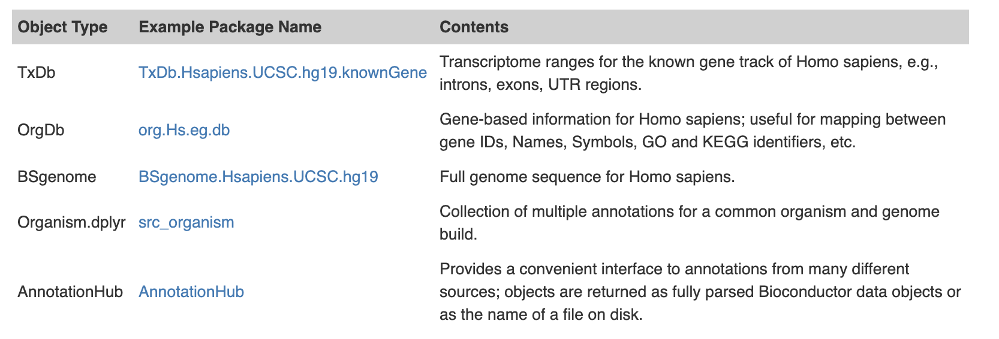

```{r setup, include=FALSE}
knitr::opts_chunk$set(echo = TRUE)
```


# Annotation
Bioconductor annotation resources have traditionally been used near the end of an analysis. After the bulk of the data analysis, annotations would be used interpretatively to learn about the most significant results. But increasingly, they are also used as a starting point or even as an intermediate step to help guide a study that is still in progress. 

Another change that is underway with annotations in Bioconductor is in the way that they are obtained. In the past annotations existed almost exclusively as separate annotation packages. Today packages are still an enormous source of annotations. The current release repository contains over eight hundred annotation packages. This table summarizes some of the more important classes of annotation objects that are often accessed using packages:

But in spite of the popularity of annotation packages, annotations are increasingly also being pulled down from web services like biomaRt or from the AnnotationHub. And both of these represent enormous resources for annotation data.





```{r, eval=FALSE}
  if (!"BiocManager" %in% rownames(installed.packages()))
       install.packages("BiocManager")
  BiocManager::install(c("AnnotationHub", "Homo.sapiens",
             "Organism.dplyr",
             "TxDb.Hsapiens.UCSC.hg19.knownGene",
             "TxDb.Hsapiens.UCSC.hg38.knownGene",
             "BSgenome.Hsapiens.UCSC.hg19", "biomaRt",
             "TxDb.Athaliana.BioMart.plantsmart22", "VariantAnnotation"))
  
```

```{r, include=FALSE}
  if (!"BiocManager" %in% rownames(installed.packages()))
       install.packages("BiocManager")
  BiocManager::install(c("AnnotationHub", "Homo.sapiens",
             "Organism.dplyr",
             "TxDb.Hsapiens.UCSC.hg19.knownGene",
             "TxDb.Hsapiens.UCSC.hg38.knownGene",
             "BSgenome.Hsapiens.UCSC.hg19", "biomaRt",
             "TxDb.Athaliana.BioMart.plantsmart22", "VariantAnnotation"))
  
```

```{r, include=FALSE}
library(AnnotationHub)
library(Homo.sapiens)
library(Organism.dplyr)
library(TxDb.Hsapiens.UCSC.hg19.knownGene)
library(TxDb.Hsapiens.UCSC.hg38.knownGene)
library(BSgenome.Hsapiens.UCSC.hg19)
library(biomaRt)
library(TxDb.Athaliana.BioMart.plantsmart22)
library(VariantAnnotation)
```


# AnnotationHub
The very 1st time that you call the AnnotationHub, it will create a cache directory on your system and download the latest metadata for the hubs current contents. From that time forward, whenever you download one of the hubs data objects, it will also cache those files in the local directory so that if you request the information again, you will be able to access it quickly.


```{r}
ah <- AnnotationHub()
```


The show method of an AnnotationHub object will tell you how many resources are currently accessible using that object as well as give a high level overview of the most common kinds of data present.

```{r}
ah
```

As you can see from the object above, there are a LOT of different resources available. So normally when you get an AnnotationHub object the 1st thing you want to do is to filter it to remove unwanted resources.

Fortunately, the AnnotationHub has several different kinds of metadata that you can use for searching and subsetting. To see the different categories all you need to do is to type the name of your AnnotationHub object and then tab complete from the ‘$’ operator. And to see all possible contents of one of these categories you can pass that value in to unique like this:


```{r}
unique(ah$dataprovider)
```

One of the most valuable ways in which the data is labeled is according to the kind of R object that will be returned to you.
```{r}
unique(ah$rdataclass)
```


Once you have identified which sorts of metadata you would like to use to find your data of interest, you can then use the subset or query methods to reduce the size of the hub object to something more manageable. For example you could select only those records where the string ‘GRanges’ was in the metadata. As you can see GRanges are one of the more popular formats for data that comes from the AnnotationHub.

```{r}
grs <- query(ah, "GRanges")
grs

grs <- ah[ah$rdataclass == "GRanges",]
grs

orgs <- subset(ah, ah$rdataclass == "OrgDb")
orgs
```

And if you really need access to all the metadata you can extract it as a DataFrame using mcols() like so:
```{r}
meta <- mcols(ah)
```
Also if you are a fan of GUI’s you can use the display method to look at your data in a browser and return selected rows back as a smaller AnnotationHub object like this:

```{r}
#sah <- display(ah)
```

Calling this method will produce a web based interface. 

Once you have the AnnotationHub object pared down to a reasonable size, and are sure about which records you want to retrieve, then you only need to use the ‘[[’ operator to extract them. Using the ‘[[’ operator, you can extract by numeric index (1,2,3) or by AnnotationHub ID. If you choose to use the former, you simply extract the element that you are interested in. So for our chain example, you might just want to 1st one like this:

```{r,include=FALSE}
res <- grs[[1]]
## loading from cache
```
```{r,eval=FALSE}
res <- grs[[1]]
## loading from cache
```

```{r}
head(res, n=3)
```


# OrgDb objects

OrgDb objects are one member of a family of annotation objects that all represent hidden data through a shared set of methods. So if you look closely at the dog object created below you can see it contains data for Canis familiaris (taxonomy ID = 9615). You can learn a little more about it by learning about the columns method.

```{r}
dog <- query(orgs, "Canis familiaris")[[1]]
dog

```

The columns method gives you a vector of data types that can be retrieved from the object that you call it on. So the above call indicates that there are several different data types that can be retrieved from the tetra object.

A very similar method is the keytypes method, which will list all the data types that can also be used as keys.
```{r}
columns(dog)
keytypes(dog)
```

Now that you can see what kinds of things can be used as keys, you can call the keys method to extract out all the keys of a given key type.
```{r}
head(keys(dog, keytype="ENTREZID"))
```
For example, using the keys method you could also extract the gene SYMBOLS that contain “COX”:
```{r}

keys(dog, keytype="SYMBOL", pattern="COX")
```
Or if you really needed an other keytype, you can use the column argument to extract the ENTREZ GENE IDs for those gene SYMBOLS that contain the string “COX”:

```{r}
keys(dog, keytype="ENTREZID", pattern="COX", column="SYMBOL")
```

But often, you will really want to extract other data that matches a particular key or set of keys. For that there are two methods which you can use. The more powerful of these is probably select. Here is how you would look up the gene SYMBOL, and REFSEQ id for specific entrez gene ID.
```{r}
select(dog, keys="804478", columns=c("SYMBOL","REFSEQ"), keytype="ENTREZID")
```

When you call it, select will return a data.frame that attempts to fill in matching values for all the columns you requested. However, if you ask select for things that have a many to one relationship to your keys it can result in an expansion of the data object that is returned. For example, watch what happens when we ask for the GO terms for the same entrez gene ID:
```{r}
#The IEA evidence code is used for annotations that are computationally, or automatically, assigned to gene products without further manual, curator review. 
select(dog, keys="804478", columns="GO", keytype="ENTREZID")
```
Because there are several GO terms associated with the gene “804478”, you end up with many rows in the data.frame.
This can become problematic if you then ask for several columns that have a many to one relationship to the original key.
Sometimes you might want to look up matching results in a way that is simpler than the data.frame object that select returns. This is especially true when you only want to look up one kind of value per key. 

```{r}
mapIds(dog, keys="804478", column="GO", keytype="ENTREZID")
```

As you can see, the mapIds method allows you to simplify the result that is returned. And by default, mapIds only returns the 1st matching element for each key. But what if you really need all those GO terms returned when you call mapIds? Well then you can make use of the mapIds multiVals argument. There are several options for this argument, we have already seen how by default you can return only the ‘first’ element. 
```{r}
mapIds(dog, keys="804478", column="GO", keytype="ENTREZID", multiVals="list")
```

# TxDb Objects

As mentioned before, TxDb objects can be accessed using the standard set of methods: keytypes(), columns(), keys(), select(), and mapIds(). But because these objects contain information about a transcriptome, they are often used to compare range based information to these important features of the genome. As a result they also have specialized accessors for extracting out ranges that correspond to important transcriptome characteristics.

Lets start by loading a TxDb object from an annotation package based on the UCSC ensembl genes track for Drosophila. A common practice when loading these is to shorten the long name to ‘txdb’ (just as a convenience).


```{r}
txdb <- TxDb.Hsapiens.UCSC.hg19.knownGene
txdb
#we can access to it also from ah object  subset(ah, ah$rdataclass == "TxDb") as we have done for OrgDb

```

Just by looking at the TxDb object, we can learn a lot about what data it contains including where the data came from, which build of the UCSC genome it was based on and the last time that the object was updated. One of the most common uses for a TxDb object is to extract various kinds of transcript data out of it. So for example you can extract all the transcripts out of the TxDb as a GRanges object like this:

```{r}
txs <- transcripts(txdb)
txs
```

Similarly, there are also extractors for ***exons(), cds(), genes() and promoters()***. 


Which kind of feature you choose to extract just depends on what information you are after. These basic extractors are fine if you only want a flat representation of these data, but many of these features are inherently nested. So instead of extracting a flat GRanges object, you might choose instead to extract a GRangesList object that groups the transcripts by the genes that they are associated with like this:

```{r}
txby <- transcriptsBy(txdb, by="gene")
txby
```

Just as with the flat extractors, there is a whole family of extractors available depending on what you want to extract and how you want it grouped. They include ***transcriptsBy(), exonsBy(), cdsBy(), intronsByTranscript(), fiveUTRsByTranscript() and threeUTRsByTranscript()***.

When dealing with genomic data it is almost inevitable that you will run into problems with the way that different groups have adopted alternate ways of naming chromosomes. This is because almost every major repository has cooked up their own slightly different way of labeling these important features.

To cope with this, the Seqinfo object was invented and is attached to TxDb objects as well as the GenomicRanges extracted from these objects. You can extract it using the seqinfo() method like this:

```{r}
si <- seqinfo(txdb)
si
```

And since the seqinfo information is also attached to the GRanges objects produced by the TxDb extractors, you can also call seqinfo on the results of those methods like this:


```{r}
txby <- transcriptsBy(txdb, by="gene")
si <- seqinfo(txby)
```
Sometimes you may have a situation where your annotation object contains data that is comparable to your data object, but where it is simply named with a different naming style. For those cases, there are helpers that you can use to discover what the current name style is for an object. And there is also a setter method to allow you to change the value to something more appropriate. So in the following example, we are going to change the seqlevelStyle from ‘UCSC’ to ‘ensembl’ based naming convention (and then back again).

```{r}
head(seqlevels(txdb))
seqlevelsStyle(txdb)
seqlevelsStyle(txdb) <- "NCBI"
head(seqlevels(txdb))
```
Then change it back
```{r}
seqlevelsStyle(txdb) <- "UCSC"
head(seqlevels(txdb))
```

In addition to being able to change the naming style used for an object with seqinfo data, you can also toggle which of the chromosomes are ‘active’ so that the software will ignore certain chromosomes. By default, all of the chromosomes are set to be ‘active’.

```{r}
head(isActiveSeq(txdb), n=30)
```
But sometimes you might wish to ignore some of them. For example, lets suppose that you wanted to ignore the Y chromosome from our txdb. You could do that like so:

```{r, eval=FALSE}
isActiveSeq(txdb)["chrY"] <- FALSE
```


# Organism.dplyr

So what happens if you have data from multiple different Annotation objects. For example, what if you had gene SYMBOLS (found in an OrgDb object) and you wanted to easily match those up with known gene transcript names from a UCSC based TxDb object? There is an ideal tool that can help with this kind of problem and it’s called an src_organism object from the Organism.dplyr package. src_organism objects and their related methods are able to query each of OrgDb and TxDb resources for you and then merge the results back together in way that lets you pretend that you only have one source for all your annotations.


src_organism objects can be created for organisms that have both an OrgDb and a TxDb. To see organisms that can have src_organism objects made, use the function supportOrganisms():

```{r}
supported <- supportedOrganisms()
print(supported, n=Inf)
```
Notice how there are multiple entries for a single organism (e.g. three for Homo sapiens). There is only one OrgDb per organism, but different TxDbs can be used. To specify a certain version of a TxDb to use, we can use the src_organism() function to create an src_organism object.
```{r, include=FALSE}
library(Organism.dplyr)
library(org.Hs.eg.db)
library(TxDb.Hsapiens.UCSC.hg38.knownGene)
```

```{r, eval=FALSE}
library(Organism.dplyr)
library(org.Hs.eg.db)
library(TxDb.Hsapiens.UCSC.hg38.knownGene)
```

```{r,eval=FALSE}
src <- src_organism("TxDb.Hsapiens.UCSC.hg38.knownGene",overwrite = TRUE)
```

```{r,include=FALSE}
src <- src_organism("TxDb.Hsapiens.UCSC.hg38.knownGene")
```

We can also create one using the src_ucsc() function. This will create an src_organism object using the most recent TxDb version available:
```{r, eval=FALSE}
src <- src_ucsc("Homo sapiens")
src
```


```{r, include=FALSE}
src <- src_ucsc("Homo sapiens")
src
```

The five methods that worked for all of the other Db objects that we have discussed (keytypes(), columns(), keys(), select(), and mapIds()) all work for src_organism objects. Here, we use keytypes() to show which keytypes can be passed to the keytype argument of select().
```{r}
keytypes(src)
columns(src)
```
You can now use these objects in the same way that you use OrgDb or TxDb objects. It works the same as the base objects that it contains:
```{r}
select(src, keys="4488", columns=c("symbol", "tx_name"), keytype="entrez")
```

Organism.dplyr also supports numerous Genomic Extractor functions allowing users to filter based on information contained in the OrgDb and TxDb objects. To see the filters supported by a src_organism() object, use supportedFIlters():

```{r}
head(supportedFilters(src))
```
Here we declare a GRangesFilter and use two different type-returning accessors to query transcripts that either start with “SNORD” and are within our given GRangesFilter, or have symbol with symbol “ADA”:
```{r}
gr <- GRangesFilter(GenomicRanges::GRanges("chr1:44000000-55000000"))
transcripts(src, filter=~(symbol %startsWith% "SNORD" & gr) | symbol == "ADA")
```

# BSgenome Objects
Another important annotation resource type is a BSgenome package. There are many BSgenome packages in the repository for you to choose from. And you can learn which organisms are already supported by using the available.genomes() function.
```{r}
head(available.genomes())
```
Unlike the other resources that we have discussed here, these packages are meant to contain sequence data for a specific genome build of an organism. You can load one of these packages in the usual way. And each of them normally has an alias for the primary object that is shorter than the full package name (as a convenience):
```{r}
Hsapiens
```

The getSeq method is a useful way of extracting data from these packages. This method takes several arguments but the important ones are the 1st two. The 1st argument specifies the BSgenome object to use and the second argument (names) specifies what data you want back out. So for example, if you call it and give a character vector that names the seqnames for the object then you will get the sequences from those chromosomes as a DNAStringSet object.

```{r}
seqNms <- seqnames(Hsapiens)
head(seqNms)
getSeq(Hsapiens, seqNms[1:2])
```

Whereas if you give the a GRanges object for the 2nd argument, you can instead get a DNAStringSet that corresponds to those ranges. This can be a powerful way to learn what sequence was present from a particular range. For example, here we can extract the range of a specific gene of interest like this.

```{r}
txby <- transcriptsBy(txdb, by="gene")
geneOfInterest <- txby[["4488"]]
res <- getSeq(Hsapiens, geneOfInterest)
res
```

# biomaRt
Another great annotation resource is the biomaRt package. The biomaRt package exposes a huge family of different online annotation resources called marts. Each mart is another of a set of online web resources that are following a convention that allows them to work with this package. So the first step in using biomaRt is always to load the package and then decide which “mart” you want to use. Once you have made your decision, you will then use the useMart() method to create a mart object in your R session. Here we are looking at the marts available and then choosing to use one of the most popular marts: the “ensembl”" mart.
```{r}
listMarts()
ensembl <- useMart("ensembl")
ensembl
```
Each ‘mart’ can contain datasets for multiple different things. So the next step is that you need to decide on a dataset. Once you have chosen one, you will need to specify that dataset using the dataset argument when you call the useMart() constructor method. Here we will point to the dataset for humans.

```{r}
head(listDatasets(ensembl))
ensembl <- useMart("ensembl",dataset="hsapiens_gene_ensembl")
ensembl
```
Next we need to think about attributes, values and filters. Lets start with attributes. You can get a listing of the different kinds of attributes from biomaRt buy using the listAttributes method:
```{r}
head(listAttributes(ensembl))
```
And you can see what the values for a particular attribute are by using the getBM method:
```{r}
head(getBM(attributes="chromosome_name", mart=ensembl))
```
Attributes are the things that you can have returned from biomaRt. They are analogous to what you get when you use the columns method with other objects.

In the biomaRt package, filters are things that can be used with values to restrict or choose what comes back. The ‘values’ here are treated as keys that you are passing in and which you would like to know more information about. In contrast, the filter represents the kind of key that you are searching for. So for example, you might choose a filter name of “chromosome_name” to go with specific value of “1”. Together these two argument values would request whatever attributes matched things on the 1st chromosome. And just as there here is an accessor for attributes, there is also an accessor for filters:
```{r}
head(listFilters(ensembl))
res <- getBM(attributes=c("hgnc_symbol", "entrezgene_id"),
                    filters = "chromosome_name",
                    values = "1", mart = ensembl)
head(res)
```


# Annotating Genomic Ranges

Variation in the  species and vcf file format
https://www.youtube.com/watch?v=DuArVnT1i-E
https://www.youtube.com/watch?v=Qgb4Ja5VnUQ
https://www.youtube.com/watch?v=2-mQO6rM2No

## Data Preparation
The first set of ranges are variants from a dbSNP Variant Call Format (VCF) file. This file can be downloaded from the ftp site at NCBI ftp://ftp.ncbi.nlm.nih.gov/snp/ and imported with readVcf() from the VariantAnnotation package. Alternatively, the file is available as a pre-parsed VCF object in the AnnotationHub. The Hub returns a VcfFile object with a reference to the file on disk.


```{r}
#library(VariantAnnotation)
fl <- system.file("extdata", "chr22.vcf.gz", package="VariantAnnotation")
```


VCF text files contain meta-information lines,
http://samtools.github.io/hts-specs/VCFv4.1.pdf
a header line with column names, data lines with information about a position in the genome, and optional genotype information on samples for each position. 

Data are read in from a VCF file and variants identified according to region such as coding, intron, intergenic, spliceSite etc. 

Amino acid coding changes are computed for the nonsynonymous variants and SIFT and PolyPhen databases provide predictions of how severly the coding changes affect protein function.


Read the data into a VCF object:
```{r}
vcf <- readVcf(fl, "hg19")
dim(vcf)
vcf
```

### Header information
Header information can be extracted from the VCF with header(). We see there are 5
samples, 1 piece of meta information, 22 info fields and 3 geno fields

```{r}
header(vcf)
```

Data can be further extracted using the named accessors.
```{r}
samples(header(vcf))
```


### Genomic positions
rowRanges contains information from the CHROM, POS, and ID fields of the VCF file,
represented as a GRanges. The paramRangeID column is meaningful when reading subsets of data and is discussed further below.
```{r}
head(rowRanges(vcf), 3)
```


Individual fields can be pulled out with named accessors. Here we see REF is stored as a DNAStringSet and qual is a numeric vector.
```{r}
ref(vcf)[1:5]
```

ALT is a DNAStringSetList (allows for multiple alternate alleles per variant) or a DNAStringSet. When structural variants are present it will be a CharacterList.
```{r}
alt(vcf)[1:5]
```


Let's create the vcf from annotationHub

```{r}
hub <- AnnotationHub()
```

Query the Hub for clinvar VCF files build with genome reference GRCh38.p13
```{r}
query(hub, "clinvar.vcf")
mcols(query(hub, "clinvar.vcf", "GRCh37"))[,"sourceurl", drop=FALSE]
```


Retrieve one of the files:
```{r}
fl <- query(hub, "clinvar.vcf", "GRCh37")[[1]]
vcf <- readVcf(fl, "hg19")
dim(vcf)
vcf
```

### Create an annotation

Overlap operations require that seqlevels and the genome of the objects match. Here the VCF seqlevels are modified to match the TxDb.
```{r}
txdb_hg19 <- TxDb.Hsapiens.UCSC.hg19.knownGene
head(seqlevels(txdb_hg19))
seqlevels(vcf)
seqlevels(vcf) <- paste0("chr", seqlevels(vcf))
#For this example we’ll annotate chromosomes 3 and 18:
seqlevels(vcf, pruning.mode="coarse") <- c("chr3", "chr18")
seqlevels(txdb_hg19) <- c("chr3", "chr18")
#The genomes already match so no change is needed.
seqlevels(vcf)
seqlevels(txdb_hg19)
unique(genome(txdb_hg19))
unique(genome(vcf))
```


The GRanges in a VCF object is extracted with ‘rowRanges()’.
```{r}
gr_hg19 <- rowRanges(vcf)
gr_hg19
```


## Location in and Around Genes

LocateVariants() in the VariantAnnotation package annotates ranges with transcript, exon, cds and gene ID’s from a TxDb. Various extractions are performed on the TxDb (exonsBy(), transcripts(), cdsBy(), etc.) and the result is overlapped with the ranges. An appropriate GRangesList can also be supplied as the annotation. Different variants such as ‘coding’, ‘fiveUTR’, ‘threeUTR’, ‘spliceSite’, ‘intron’, ‘promoter’, and ‘intergenic’ can be searched for by passing the appropriate constructor as the ‘region’ argument: CodingVariants, IntronVariants, FiveUTRVariants, ThreeUTRVariants, IntergenicVariants, SpliceSiteVariants, PromoterVariants, AllVariants. 

```{r}
loc_hg19 <- locateVariants(gr_hg19, txdb_hg19, AllVariants())
loc_hg19
table(loc_hg19$LOCATION)
```


## Annotating Variants:Amino acid coding changes
For the set of dbSNP variants that fall in coding regions, amino acid changes can be computed. The output contains one line for each variant-transcript match which can result in multiple lines for each variant.
```{r}
head(predictCoding(vcf, txdb_hg19, Hsapiens), 3)
```


