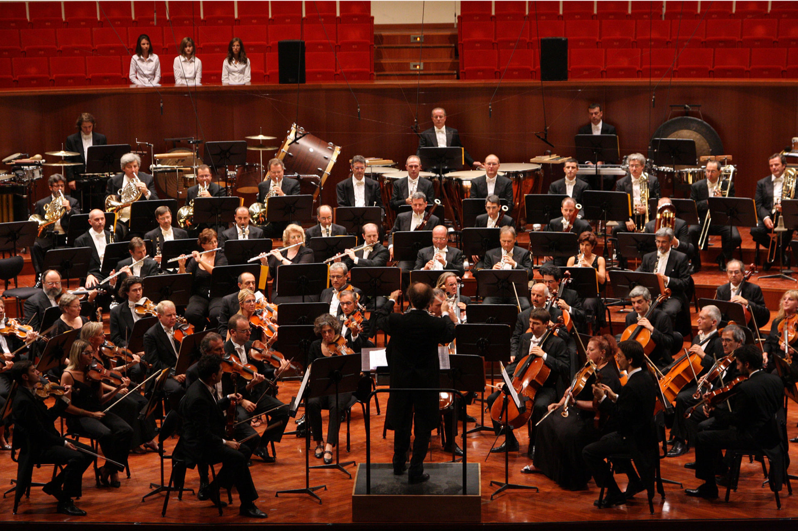

```{r setup, include=FALSE}
knitr::opts_chunk$set(echo = TRUE)
```


# What is Bioconductor

Bioconductor provides tools for the analysis and comprehension of high-throughput genomic data. Bioconductor uses the R statistical programming language, and is open source and open development. It has two releases each year, and an active user community. Bioconductor is also available as an AMI (Amazon Machine Image) and a series of Docker images.



# Biology Pills

DNA, Chromosomes, and Genes  (4':39'')
https://www.youtube.com/watch?v=-i1_JagCL1U

Genome Sequencing 
https://www.youtube.com/watch?v=2JUu1WqidC4


Gene regulations
https://www.khanacademy.org/test-prep/mcat/biomolecules/gene-control/v/regulation-of-transcription

Post-trascriptional regulation
https://www.khanacademy.org/test-prep/mcat/biomolecules/gene-control/v/post-translational-regulation


# Install BiocManager

```{r, eval=FALSE}
if (!requireNamespace("BiocManager", quietly = TRUE))
    install.packages("BiocManager")
BiocManager::install()
```

# Resources
https://www.bioconductor.org/install/

Packages

Help on line

Workflow

Documentation

# Install Packages 

```{r, eval=FALSE}
BiocManager::install(c("NAME PACKAGE"))
```

# Basic BioConductor Data Structures --IntervalRanges - IRanges

IRanges is a vector, that contains integer intervals. Sounds a little funny, but let's take an example. We construct an IRanges by using the IRanges constructor function, and we give two out of three arguments, start, end, and with. We only need two, because if we know two of them, the last one can be inferred. 

```{r, eval= FALSE, results='hide'}
BiocManager::install(c("IRanges"))
```

```{r, include=FALSE}
library(IRanges)
```

```{r, eval=FALSE}
library(IRanges)
```

```{r}
ir1 <- IRanges(start = c(1,3,5), end = c(3,5,7))
ir1
```
So here we have a start, an end, a width, and we can see the width column has been filled by knowing the start and the end. Here we construct another IRange by specifying the start and the width, and we get exactly the same object out. 

```{r}
ir2 <- IRanges(start = c(1,3,5), width = 3)
ir2
all.equal(ir1, ir2)
```

An IRanges consist of separate intervals; each interval is called a range. So ir1 above contains 3 ranges.

Methods: start(), end(), width() and also replacement methods.

```{r}
start(ir1)
```
## Resize 
```{r}
width(ir2) <- 1
ir2
```
## Name
```{r}
names(ir1) <- paste("A", 1:3, sep = "")
ir1
```
IRanges  have a single dimension, there are vectors no matrices
```{r}
dim(ir1)
length(ir1)
```

## Subsetting 
Subsetting works like a vector
```{r}
ir1[1]
ir1["A1"]
```
## Concatenate

Like vectors, you can concatenate two IRanges with the c() function
```{r}
c(ir1, ir2)
```

```{r, echo=FALSE}
plotRanges <- function(x, xlim=x, main=deparse(substitute(x)),
                       col="black",sep=0.5,...){
  height <-1
  if(is(xlim, "Ranges"))
    xlim<-c(min(start(xlim)),max(end(xlim)))
   bins<- disjointBins(IRanges(start(x), end(x)+1))
  plot.new()
  plot.window(xlim, c(0, max(bins)*(height+sep)))
  ybottom <- bins*(sep+height) -height
  rect(start(x)-0.5, ybottom, end(x)+0.5, ybottom+height, col=col,...)
  title(main)
  axis(1)
}
par(mfrow = c(2,1))

```

## Normal IRanges
A normal IRanges is a minimal representation of the IRanges viewed as a set. Each integer only occur in a single range and there are as few ranges as possible. In addition, it is ordered. Many functions produce a normal IRanges. Created by reduce().

Given the following IRange
```{r}
ir <- IRanges(start= c(1,3,7,9), end=c(4,4,8,10))
plotRanges(ir)
```

```{r}
ir1 <- reduce(ir)
plotRanges(ir1) 
```  
  
From some perspective, disjoin() is the opposite of reduce(). 
```{r}
ir2<- disjoin(ir)
plotRanges(ir2)
```

## Manipulating IRanges, intra-ranges

Intra-range manipulations are manipulations where each original range gets mapped to a new range. Examples of these are: shift(), narrow(), flank(), resize(), restrict().

For example, resize() can be extremely useful. It has a fix argument controlling where the resizing occurs from.

Use fix="center" to resize around the center of the ranges.
```{r}
ira<- resize(ir, width = 1, fix = "start")
plotRanges(ira)
```

```{r}
ira<- resize(ir, width = 1, fix = "center")
plotRanges(ira)
```

## Manipulating IRanges, as sets

Manipulating IRanges as sets means that we view each IRanges as a set  of integers; individual integers is either contained in one or more ranges or they are not. 
This is equivalent to calling reduce() on the IRanges first.

Once this is done, we can use standard:  union(), intersect(), setdiff(), gaps() 
between two IRanges (which all returns normalized  IRanges).

```{r}
par(mfrow = c(3,1))
ir1 <- IRanges(start = c(1, 3, 5), width = 1)
plotRanges(ir1)
ir2 <- IRanges(start = c(4, 5, 6), width = 1)
plotRanges(ir2)
ir3<- union(ir1, ir2)
plotRanges(ir3)
```

```{r}
ir4 <-intersect(ir1, ir2)
plotRanges(ir4)
```

Because they return normalized IRanges, an alternative to union() is
```{r}
ir5 <- reduce(c(ir1, ir2))
plotRanges(ir5)
```

## Overlaps
Finding (pairwise) overlaps between two IRanges is done by findOverlaps(). This function is very important and amazingly fast!
```{r}  
ir1 <- IRanges(start = c(1,4,8), end = c(3,7,10))
ir1
ir2 <- IRanges(start = c(3,4), width = 3)
ir2
ov <- findOverlaps(ir1, ir2)
ov
```

It returns a Hits object which describes the relationship between the two IRanges.
This object is basically a two-column matrix of indicies into the two IRanges.
The two columns of the hits object can be accessed by queryHits() and subjectHits()
(often used with unique()).

For example, the first row of the matrix describes that the first range of ir1 
overlaps with the first range of ir2. Or said differently, 
they have a non-empty intersection:
```{r}  
intersect(ir2[subjectHits(ov)[1]],
            ir1[queryHits(ov)[1]])
```


The elements of unique(queryHits)  gives you the indices of the query ranges which actually had an overlap; you need unique because a query range may overlap multiple subject ranges.
```{r}  
queryHits(ov)
unique(queryHits(ov))
```

The list of arguments to findOverlaps() is long; there are a few hidden treasures here. For example, you can ask to only get an overlap if two ranges overlap by a certain number of bases.

```{r} 
args(findOverlaps)
```

## CountOverlaps
For efficiency, there is also countOverlaps(), which just returns the number of overlaps.
This function is faster and takes up less memory because it does not have to keep 
track of which ranges overlap, just the number of overlaps.
```{r} 
countOverlaps(ir1, ir2)
```
## Finding nearest IRanges

Sometimes you have two sets of IRanges and you need to know which ones are closest to each other. Functions for this include  nearest(), precede(), follow(). 

```{r}   
ir1
ir2
nearest(ir1, ir2)
```

# Basic BioConductor Data Structures-- GenomicRanges - GRanges

```{r, include=FALSE}   
BiocManager::install(c("GenomicRanges"))
library(GenomicRanges)
```

```{r, eval=FALSE}   
BiocManager::install(c("GenomicRanges"))
library(GenomicRanges)
```

GRanges are like IRanges with strand and chromosome. 
Strand can be +, - and *. 
The value * indicates ‘unknown strand’ or ‘unstranded’. 
This value usually gets treated as a third strand, which is sometimes confusing to users (examples below).

A GRange is very similar to an IRanges with some additional having to do with chromosome 
and strength. Cromosones in GRanges are called seqnames. They get created with the GRanges constructor:

```{r}   
gr <- GRanges(seqnames = "chr1", strand = c("+", "-", "+"),
                ranges = IRanges(start = c(1,3,5), width = 3))
gr
```

Natural accessor functions: strand(), seqnames(), ranges(), start(), end(), width().

Because they have strand, we now have operations which are relative 
to the direction of transcription (upstream(), downstream()):

## Intra-ranges-operations


```{r} 
shift(gr, 5)
resize(gr, 30)
```

to get help ?"intra-range-methods" 

## Seqinfo
GRanges operates within a universe of sequences (chromosomes/contigs) and their lengths.
This is described through seqinfo:
```{r} 
seqinfo(gr)
seqlengths(gr) <- c("chr1" = 10)
seqinfo(gr)
seqlevels(gr)
seqlengths(gr)
```
Especially the length of the chromosomes are used by some functions. 
For example gaps() return the stretches of the genome not covered by the GRanges.
```{r} 
gaps(gr)
```
In this example, we know that the last gap stops at 10, because that is the length of the chromosome. Note how a range on the * strand appears in the result.

Let us expand the GRanges with another chromosome
```{r} 
seqlevels(gr) <- c("chr1", "chr2")
seqnames(gr) <- c("chr1", "chr2", "chr1")
gr
```
When you sort() a GRanges, the sorting order of the chromosomes is determined by 
their order in seqlevel. This is nice if you want the sorting “chr1”, “chr2”, …, “chr10”, …
```{r} 
sort(gr)
```

The sort is sensible to the order of defined seqlevels
```{r} 
seqlevels(gr) <- c("chr2", "chr1")
sort(gr)
```


You can associate a genome with a GRanges.
```{r} 
genome(gr) <- "hg19"
gr
seqinfo(gr)
```

This becomes valuable when you deal with data from different genome versions (as we all do),
because it allows R to throw an error when you compare two GRanges from different genomes, like
```{r, eval=FALSE} 
gr2 <- gr
genome(gr2) <- "hg18"
findOverlaps(gr, gr2)

ERROR in mergeNameAtomicVector
```

## Basic GRanges Usage -- DataFrame
DataFrame class is very similar to the base data.frame class from R, but it allows columns of any class, provided a number of required methods are supported. For example, DataFrame can have IRanges as columns, unlike data.frame:

```{r} 
ir <- IRanges(start = 1:2, width = 3)
df1 <- DataFrame(iranges = ir)
df1
df1$iranges
```
In the data.frame case, the IRanges gives rise to 4 columns, whereas it is a single column when a DataFrame is used.
```{r} 
df2 <- data.frame(iranges = ir)
df2
```


##  Metadata

GRanges (unlike IRanges) may have associated metadata. This is immensely useful. 
The formal way to access and set this metadata is through values or elementMetadata or mcols, like
```{r} 
gr <- GRanges(seqnames = "chr1", strand = c("+", "-", "+"),
              ranges = IRanges(start = c(1,3,5), width = 3))
gr
values(gr) <- DataFrame(score = c(0.1, 0.5, 0.3))
gr
```

A much easier way to set and access metadata is through the $ operator to access
```{r} 
gr$score
```
to add
```{r} 
gr$score2 = gr$score * 0.2
gr
```

## FindOverlaps

findOverlaps works exactly as for IRanges. 
```{r}
gr2 <- GRanges(seqnames = c("chr1", "chr2", "chr1"), strand = "*",
               ranges = IRanges(start = c(1, 3, 5), width = 3))
gr2

gr
findOverlaps(gr, gr2)
```


## SubsetByOverlaps
A common operation is to select only certain ranges from a GRanges which overlap something else.  Enter the convenience function  subsetByOverlaps
```{r}
subsetByOverlaps(gr, gr2)
```
## MakeGRanges Fromn DataFrame

A common situation is that you have data which looks like a GRanges but is really stored 
as a classic data.frame, with chr, start etc. The makeGRangesFromDataFrame converts this data.frame into a GRanges. An argument tells you whether you want to keep any additional columns.
```{r}
df <- data.frame(chr = "chr1", start = 1:3, end = 4:6, score = 7:9)
df
makeGRangesFromDataFrame(df)
makeGRangesFromDataFrame(df, keep.extra.columns = TRUE)
```

## Seqinfo 
```{r}
BiocManager::install(c("GenomeInfoDb"))
library(GenomeInfoDb)
```
## Drop and keep seqlevels
It is common to want to remove seqlevels from a GRanges object. 
Use  pruning.mode="coarse", the default value is  pruning.mode="error" meaning it returns an error and does not drop levels
```{r}
gr <- GRanges(seqnames = c("chr1", "chr2"),
              ranges = IRanges(start = 1:2, end = 4:5))
gr
seqlevels(gr, pruning.mode="coarse") <- c("chr1")
gr
```

You can also just get rid of weird looking chromosome names with keepStandardChromosomes().
```{r}
gr <- GRanges(seqnames = c("chr1", "c5hrU34"),
              ranges = IRanges(start = 1:2, end = 4:5))
gr
keepStandardChromosomes(gr,pruning.mode="coarse")
```

## Changing style
It is an inconvenient truth that different online resources uses different naming convention 
for chromosomes. This can even be different from organism to organism. 
For example, for the fruitfly (Drosophila Melanogaster) NCBI and Ensembl
uses “2L” and UCSC uses “chr2L”. But NCBI and Ensembl differs on some contigs: NCBI uses “Un” and Ensembl used “U”.
```{r}
gr <- GRanges(seqnames = "chr1", ranges = IRanges(start = 1:2, width = 2))
gr
#Let us remap
newStyle <- mapSeqlevels(seqlevels(gr), "NCBI")
gr <- renameSeqlevels(gr, newStyle)
gr
```

This can in principle go wrong, if the original set of seqlevels are inconsistent
(not a single style).
The GenomeInfoDb also contains information for dropping / keeping various classes of chromosomes:
  

## Rle (run-length-encoded) vector

We will discuss a data representation class called Rle (run length encoding). 
This class is great for representation genome-wide sequence coverage.
In high-throughput sequencing, coverage is the number of reads overlapping each base.  In other words, it associates a number (the number of reads) to every base in the genome.

This is a fundamental quantity for many high-throughout sequencing analyses.  For variant calling (DNA sequencing) it tells you how much power (information)  you have to call a variant at a given location.  For ChIP sequencing it is the primary signal;  areas with high coverage are thought to be enriched for a given protein. A file format which is often used to represent coverage data is Wig or the modern version BigWig.


Look at the name of the columns og GRanges. Look at Rle.  
```{r}
gr <- GRanges(seqnames = "chr1", ranges = IRanges(start = 1:10, width = 3))
gr
```


An Rle (run-length-encoded) vector is a specific representation of a vector. The IRanges package implements support for this class. Watch out: there is also a base R class called rle which has much less functionality.

The run-length-encoded representation of a vector, represents the vector as a set of distinct runs with their own value. Let us take an example

```{r}
rl <- Rle(c(1,1,1,1,2,2,3,3,2,2))
rl
runLength(rl)
runValue(rl)
as.numeric(rl)
```

This is a very efficient representation if the vector is very long there are a lot of consecutive elements with the same value. This is especially useful for genomic data which is either piecewise constant, or where most of the genome is not covered (eg. RNA sequencing in mammals).

In many ways Rles function as normal vectors, you can do arithmetic with them, transform them etc. using standard R functions like + and  log2.

There are also RleList which is a list of Rles.  This class is used to represent a genome wide coverage track where each element of the list is a different chromosome.


## GenomicRanges - Lists


We will discuss GRangesList which is a list of GRanges
```{r}
gr1 <- GRanges(seqnames = "chr1", ranges = IRanges(start = 1:4, width = 3))
gr2 <- GRanges(seqnames = "chr2", ranges = IRanges(start = 1:4, width = 3))
gL <- GRangesList(gr1 = gr1, gr2 = gr2)
gL
```

A number of standard GRanges functions work
```{r}
seqnames(gL)

#Kind of xxapply
shift(gL, 10)
```

findOverlaps works slightly different. For GRangesLists, we think of each element is a union of ranges. So we get an overlap if any range overlaps.
```{r}
findOverlaps(gL, gr2)
```

Note how the queryLength is 2 and not 20. What we know from the first row of this output is that some range
in gL[[2]] overlaps the range gr[1].

This is actually a feature if we think of the GRangesList as a set of transcript, where each GRanges gives you the exon of the transcript. With this interpretation, 
findOverlaps tells you whether or not the transcript overlaps some region of interest, and this is true if any of the exons of the transcript overlaps the region.


# Biostrings


```{r, include=FALSE}
BiocManager::install(c("Biostring"))
library(Biostrings)
```

```{r,eval=FALSE}
BiocManager::install(c("Biostring"))
library(Biostrings)
```


The Biostrings package contains classes and functions for representing biological strings such as DNA,
RNA and amino acids. In addition the package has functionality for pattern matching (short read alignment) 
as well as a pairwise alignment function implementing Smith-Waterman local alignments and Needleman-Wunsch 
global alignments used in classic sequence alignment (see (Durbin et al. 1998)  for a description of these algorithms). 
There are also functions for reading and writing output such as FASTA files.


## Representing sequences

There are two basic types of containers for representing strings. One container represents a single string (say a chromosome or a single short read) and the other container represents a set of strings (say a set of short reads). 

There are different classes intended to represent different types of sequences such as DNA or RNA sequences.

```{r}
dna1 <- DNAString("ACGT-N")
dna1

dna2 <- DNAStringSet(c("ACGT", "GTCA", "GCTA"))
dna2
```
Note that the alphabet of a DNAString is an extended alphabet: - (for insertion) and N are allowed. 
In fact, IUPAC codes are allowed (these codes represent different characters, 
for example the code “M” represents either and “A” or a “C”). A list of IUPAC codes can be obtained by

```{r}
IUPAC_CODE_MAP
```


Indexing into a DNAString retrieves a subsequence (similar to the standard R function substr), 
whereas indexing into a DNAStringSet gives you a subset of sequences.
```{r}
dna1[2:4]
dna2[2:3]
```


Note that [[ allows you to get a single element of a DNAStringSet as a DNAString. 
```{r}
dna2[[2]]
```

DNAStringSet objects can have names, like ordinary vectors
```{r}
names(dna2) <- paste0("seq", 1:3)
dna2
```

The full set of string classes are

DNAString[Set]: DNA sequences.
RNAString[Set]: RNA sequences.
AAString[Set]: Amino Acids sequences (protein).
BString[Set]: “Big” sequences, using any kind of letter.

These classes seem very similar to standard characters() from base R, but there are important differences. 
The differences are mostly about efficiencies when you deal with either (a) many sequences or 
(b) very long strings (think whole chromosomes).

## Basic functionality

Basic character functionality is supported, like length, names.

c and rev (reverse the sequence).

width, nchar (number of characters in each sequence).

==, duplicated, unique.

as.charcater or toString: converts to a base character() vector.

sort, order.

chartr: convert some letters into other letters.

subseq, subseq<-, extractAt, replaceAt.

replaceLetterAt.
```{r}
width(dna2)
sort(dna2, decreasing=TRUE)
rev(dna2)
rev(dna1)
```


Note that rev on a DNAStringSet just reverse the order of the elements, whereas rev on a DNAString actually reverse the string.

## Biological functionality

There are also functions which are related to the biological interpretation of the sequences, including

reverse: reverse the sequence.

complement, reverseComplement: (reverse) complement the sequence.

translate: translate the DNA or RNA sequence into amino acids.

```{r}
translate(dna2)
reverseComplement(dna1)
```

## Counting letters

We very often want to count sequences in various ways. Examples include:
  
Compute the GC content of a set of sequences.

Compute the frequencies of dinucleotides in a set of sequences.

Compute a position weight matrix from a set of aligned sequences.

There is a rich set of functions for doing this quickly.

alphabetFrequency, letterFrequency: Compute the frequency of all characters (alphabetFrequency) or only specific letters (letterFrequency).

dinucleotideFrequency, trinucleotideFrequency, 
oligonucleotideFrequeny: compute frequencies of dinucleotides (2 bases), trinucleotides (3 bases) and oligonucleotides (general number of bases).

consensusMatrix: consensus matrix; almost a position weight matrix.

Let’s look at some examples, note how the output expands to a matrix when you use the functions on a DNAStringSet:

```{r}  
alphabetFrequency(dna1)
alphabetFrequency(dna2)
letterFrequency(dna2, "GC")
```

consensusMatrix() can be used to just compute the alphabet frequency for each position in the input sequences (most functions allows the return of probabilities with as.prob = TRUE):
```{r}
consensusMatrix(dna2, as.prob = TRUE)
```


