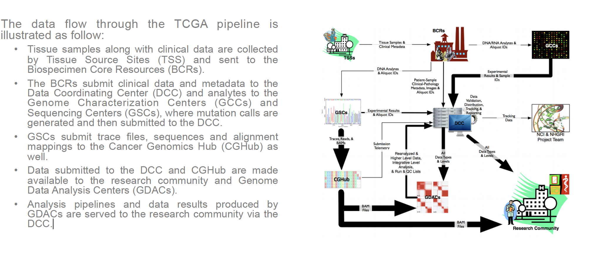
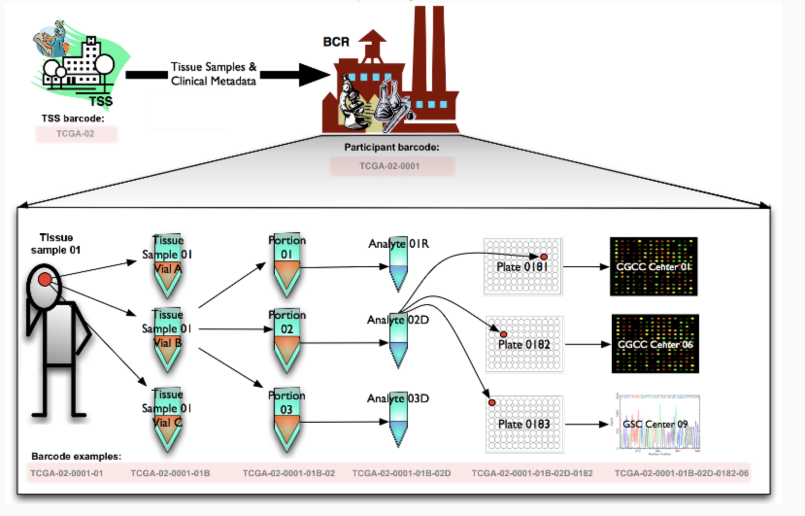
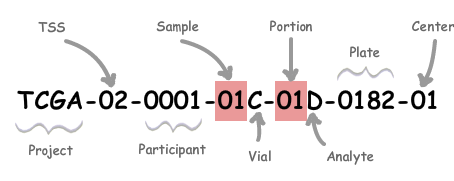
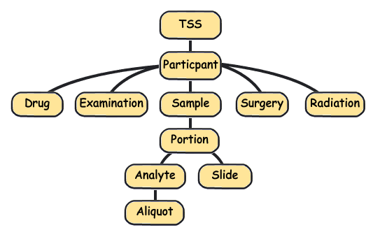

```{r setup, include=FALSE}
#error TRUE to show error in document
knitr::opts_chunk$set(echo = TRUE, error=TRUE )
```


```{r, include=FALSE}
  if (!"BiocManager" %in% rownames(installed.packages()))
       install.packages("BiocManager")
  BiocManager::install(c("SummarizedExperiment", "airway","MultiAssayExperiment","curatedTCGAData","TCGAutils"))

  
```


```{r, eval=FALSE}
  if (!"BiocManager" %in% rownames(installed.packages()))
       install.packages("BiocManager")
  BiocManager::install(c("SummarizedExperiment", "airway","MultiAssayExperiment","curatedTCGAData","TCGAutils"))

  
```

```{r, include=FALSE}
library(SummarizedExperiment)
library(MultiAssayExperiment)
library(curatedTCGAData)
library(TCGAutils)
```

```{r, eval=FALSE}
library(SummarizedExperiment)
library(MultiAssayExperiment)
library(curatedTCGAData)
library(TCGAutils)
```

# (Ranged) SummarizedExperiment
The SummarizedExperiment class is used to store rectangular matrices of experimental results, which are commonly produced by sequencing and microarray experiments. Each object stores observations of one or more samples, along with additional meta-data describing both the observations (features) and samples (phenotypes).

A key aspect of the SummarizedExperiment class is the coordination of the meta-data and assays when subsetting. For example, if you want to exclude a given sample you can do for both the meta-data and assay in one operation, which ensures the meta-data and observed data will remain in sync. 


## Anatomy of a SummarizedExperiment
The SummarizedExperiment package contains two classes: SummarizedExperiment and  RangedSummarizedExperiment.

__SummarizedExperiment__ is a matrix-like container where rows represent features of interest (e.g. genes, transcripts, exons, etc.) and columns represent samples.
__The objects contain one or more assay, each represented by a matrix-like object of numeric or other type. All assays of the same SummarizedExperiment must have the same number of rows and columns.__
The rows of a SummarizedExperiment object represent features of interest. Information about these features is stored in a DataFrame object, accessible using the function __rowData()__. Each row of the  DataFrame provides information on the feature in the corresponding row of the  SummarizedExperiment object. Columns of the rowData() DataFrame represent different attributes of the features of interest, e.g., gene or transcript IDs, etc.
The columns of a SummarizedExperiment object rapresent samples. Information about samples are stored in the __colData()__ object.

__RangedSummarizedExperiment__ is the child of the SummarizedExperiment class which means that all the methods on SummarizedExperiment also work on a RangedSummarizedExperiment.

The fundamental difference between the two classes is that the rows of a RangedSummarizedExperiment object represent genomic ranges of interest instead of a  DataFrame of features. The RangedSummarizedExperiment ranges are described by a  GRanges or a GRangesList object, accessible using the __rowRanges()__ function.

```{r}
data(airway, package="airway")
air <- airway
air
dim(air)
```

To retrieve the experiment data from a SummarizedExperiment object one can use the  __assays()__ accessor. An object can have multiple assay datasets each of which can be accessed using the $ operator. The airway dataset contains only one assay (counts). Here each row represents a gene transcript and each column one of the samples.

```{r}
head(assays(air)$counts)
```
There are two accessor functions for extracting the assay data from a SummarizedExperiment object. _assays()_ operates on the entire list of assay data as a whole, while _assay()_ operates on only one assay at a time.

```{r}
assays(air)
head(assays(air)[[1]])
head(assay(air))
```

The __rowRanges()__ accessor is used to view the range information for a RangedSummarizedExperiment. (Note if this were the parent SummarizedExperiment class we’d use _rowData()_). The data are stored in a GRangesList object.


```{r}
rowRanges(air)
```

Sample meta-data describing the samples can be accessed using __colData()__, and is a  _DataFrame_ that can store any number of descriptive columns for each sample row.


```{r}
colData(air)
```

Meta-data describing the experimental methods and publication references can be accessed using  __metadata()__.

```{r}
metadata(air)
```

Note that metadata() is just a simple list, so it is appropriate for any experiment wide metadata the user wishes to save, such as storing model formulas.

```{r}
metadata(air)$formula <- counts ~ dex + albut
metadata(air)
```


## Constructing a SummarizedExperiment
Often, SummarizedExperiment or RangedSummarizedExperiment objects are returned by functions written by other packages. However it is possible to create them by hand with a call to the SummarizedExperiment() constructor.

Constructing a RangedSummarizedExperiment with a GRanges as the rowRanges argument:

```{r}
nrows <- 200
ncols <- 6
counts1 <- matrix(runif(nrows * ncols, 1, 2000), nrows)
counts2 <- matrix(runif(nrows * ncols, 1, 50), nrows)
rowRanges <- GRanges(rep(c("chr1", "chr2"), c(50, 150)),
                     IRanges(floor(runif(200, 1e5, 1e6)), width=100),
                     strand=sample(c("+", "-"), 200, TRUE),
                     feature_id=sprintf("ID%03d", 1:200))
colData <- DataFrame(Treatment=rep(c("ChIP", "Input"), 3),
                     row.names=LETTERS[1:6])

se=SummarizedExperiment(assays=list(exp1=counts1,exp2=counts2),
                     rowRanges=rowRanges, colData=colData)

head(assays(se)$exp2)
```

A SummarizedExperiment can be constructed with or without supplying a DataFrame for the rowData argument:

```{r}
SummarizedExperiment(assays=list(counts=counts1), colData=colData)
```

Remember that the number of assay sizes must be equal, otherwise as in the following example the result is the error:
```{r}
counts1 <- matrix(runif(nrows * ncols, 1, 2000), 100) #100x12
counts2 <- matrix(runif(nrows * ncols, 1, 50), 50) #50x24
se=SummarizedExperiment(assays=list(exp1=counts1,exp2=counts2),
                     rowRanges=rowRanges, colData=colData)
```


## Common operations on SummarizedExperiment
### Subsetting

Performs two dimensional subsetting, just like subsetting a matrix or data frame.
```{r}
# subset the first five transcripts and first three samples
air[1:5, 1:3]
```

Extracting the assay data from a SummarizedExperiment object.
```{r}
assays(air)[[1]][1:5, 1:5]
assay(air)[1:5, 1:5]
```

Sample extraction/filtering on colData() columns with $ operator.
```{r}
air[, se$cell == "N61311"]
```

Filter on rowData().

```{r}
#Need to build a new SummarizedExperiment example
counts <- matrix(1:15, 5, 3, dimnames=list(LETTERS[1:5], LETTERS[1:3]))
counts

dates <- SummarizedExperiment(assays=list(counts=counts),
                              rowData=DataFrame(month=month.name[1:5], day=1:5))
dates

# Subset all January assays
dates[rowData(dates)$month == "January", ]
```


### Range-based operations
SummarizedExperiment objects support all of the  findOverlaps() methods and associated functions. This includes subsetByOverlaps(), which makes it easy to subset a SummarizedExperiment object by an interval.

```{r}
roi <- GRanges(seqnames="1", ranges=100000:1100000)
subsetByOverlaps(air, roi)
```


# MultiAssayExperiment
MultiAssayExperiment offers a data structure for representing and analyzing multi-omics experiments: a biological analysis approach utilizing multiple types of observations, such as DNA mutations and abundance of RNA and proteins, in the same biological specimens.


A visual representation of the MultiAssayExperiment class and its accessor functions can be seen below. There are three main components: _ExperimentList_, _colData_, _sampleMap_.


A MultiAssayExperiment can contain any number of assays with different representations. Assays may be ID-based, where measurements are indexed identifiers of genes, microRNA, proteins, microbes, etc. Alternatively, assays may be range-based, where measurements correspond to genomic ranges that can be represented as GRanges objects, such as gene expression or copy number.
The following data classes have been tested to work as elements of a MultiAssayExperiment: _matrix_, _SummarizedExperiment_, _RangedSummarizedExperiment_, _RaggedExperiment_, _RangedVcfStack_, _DelayedMatrix_.

>For ID-based assays, there is no requirement that the same IDs be present for different experiments. For range-based assays, there is also no requirement that the same ranges be present for different experiments; furthermore, it is possible for different samples within an experiment to be represented by different ranges.__This is the main differences with SummarizedExperiment, where each assay must have the same dimension.__


```{r}
# Get started by trying out MultiAssayExperiment using a subset of the TCGA adrenocortical carcinoma (ACC) dataset provided with the package. 
data(miniACC)
miniACC

rownames(miniACC)

colnames(miniACC)
```

## colData
The column names correspond to samples, and are used to match assay data to specimen metadata stored in _colData_.

The _colData_ dataset should be of class _DataFrame_ but can accept a _data.frame_ class object that will be coerced.

In order to relate metadata of the biological unit, the row names of the _colData_ dataset must contain patient identifiers.

```{r}
colData(miniACC)[1:4, 1:4]
table(miniACC$race)
```

Key points:

- __Each row maps to zero or more observations in each experiment in the ExperimentList (assays)__.

- One row per biological unit.

+ MultiAssayExperiment supports both missing observations and replicate observations, ie one row of colData can map to 0, 1, or more columns of any of the assays.

+ therefore you could treat replicate observations as one or multiple rows of _colData_.

+ multiple time points, or distinct biological replicates, should probably be separate rows of the _colData_.

## ExperimentList
The _ExperimentList_ slot and class is the container workhorse for the MultiAssayExperiment class. It contains all the experimental data (assays).

The datasets contained in elements of the ExperimentList can have: column names (required), row names (optional).

```{r}
# A base list or ExperimentList object 
experiments(miniACC)
class(experiments(miniACC))
#Select single experiment
experiments(miniACC)[[1]] #RNASeq2GeneNorm
#Select single experiment
experiments(miniACC)[["gistict"]]
#Select multiple experiments
experiments(miniACC)[c(1,2)]
```
Key Points:

- One matrix-like dataset per list element
  
- One matrix column per assayed specimen. __Each matrix column must correspond to exactly one row of colData__: in other words, you must know which patient or cell line the observation came from. However, multiple columns can come from the same patient, or there can be no data for that patient.

- Matrix rows correspond to variables, e.g. genes or genomic ranges

## sampleMap: relating colData to multiple assays

The _sampleMap_ is a _DataFrame_ that relates the “primary” data (_colData_) to the experimental assays.
The _sampleMap_ provides an unambiguous map from every experimental observation to one and only one row in _colData_. It is, however, permissible for a row of _colData_ to be associated with multiple experimental observations or no observations at all. In other words, there is a  “many-to-one” mapping from experimental observations to rows of _colData_, and a “one-to-any-number” mapping from rows of _colData_ to experimental observations.

In simple cases where the column names of ExperimentList data matrices match the row names of colData, the user won’t need to specify or think about a sample map, it can be created automatically by the MultiAssayExperiment constructor.

sampleMap is a simple three-column DataFrame:

- __assay__ column: the name of the assay, and found in the names of ExperimentList list names

- __primary__ column: identifiers of patients or biological units, and found in the __row names of colData__

- __colname__ column: identifiers of assay results, and found in the __column names of ExperimentList elements__. 

```{r}
sampleMap(miniACC)
```

## metadata

Metadata can be used to keep additional information about patients, assays performed on individuals or on the entire cohort, or features such as genes, proteins, and genomic ranges. Metadata can be added at different levels of the MultiAssayExperiment.
Can be of ANY class, for storing study-wide metadata, such as citation information.

```{r}
metadata(miniACC)
```

## MultiAssayExperiment Subsetting

In pseudo code below, the subsetting operations work on the rows of the following indices: 1. _i_ experimental data rows 2. _j_ the primary names or the column names (entered as a list or List) 3. _k_ assay

```
multiassayexperiment[i = rownames, j = primary or colnames, k = assay]
```

Subsetting operations always return another MultiAssayExperiment. For example, the following will return any rows named _“MAPK14”_ or _“IGFBP2”_, and remove any assays where no rows match:
```{r}
miniACC[c("MAPK14", "IGFBP2"), , ]
```

The following will keep only patients of pathological _stage iv_, and all their associated assays:
```{r}
colnames(colData(miniACC))
head(colData(miniACC))
miniACC[, miniACC$pathologic_stage == "stage iv", ]
```

And the following will keep only the RNA-seq dataset, and only patients for which this assay is available:
```{r}
miniACC[, , "RNASeq2GeneNorm"]
```

The "double bracket" method ( [[ ) is a convenience function for extracting a single element of the MultiAssayExperiment ExperimentList.
```{r}
miniACC[[1]]  #or equivalently, miniACC[["RNASeq2GeneNorm"]]
```


## Complete cases

__complete.cases()__ shows which patients have complete data for all assays:

```{r}
summary(complete.cases(miniACC))
head(complete.cases(miniACC))
```
The above logical vector could be used for patient subsetting. More simply, __intersectColumns()__ will select complete cases and rearrange each ExperimentList element so its columns correspond exactly to rows of _colData_ in the same order:
```{r}
accmatched = intersectColumns(miniACC)
accmatched
```
Note, the column names of the assays in _accmatched_ are not the same because of assay-specific identifiers, but they have been automatically re-arranged to correspond to the same patients.


__intersectRows()__ keeps only rows that are common to each assay, and aligns them in identical order. For example, to keep only genes where data are available for RNA-seq, GISTIC copy number, and somatic mutations:
```{r}
accmatched2 <- intersectRows(miniACC[, , c("RNASeq2GeneNorm", "gistict", "Mutations")])
accmatched2
```
## _c_ - concatenate to MultiAssayExperiment

The _c_ function allows the user to concatenate an additional experiment to an existing MultiAssayExperiment. The optional sampleMap argument allows concatenating an assay whose column names do not match the row names of _colData_. For convenience, the mapFrom argument allows the user to map from a particular experiment provided that the order of the colnames is in the same.

```{r}
miniACC2 <- c(miniACC, log2rnaseq = log2(assays(miniACC)$RNASeq2GeneNorm), mapFrom=1)
experiments(miniACC2)

miniACC3 <- c(miniACC, log2miRNAseq = log2(assays(miniACC)$miRNASeqGene), mapFrom="miRNASeqGene")
experiments(miniACC3)

#wrong mapping
miniACC4 <- c(miniACC, log2miRNAseq = log2(assays(miniACC)$RNASeq2GeneNorm), mapFrom=2L)


```


## MultiAssayExperiment class construction example

The MultiAssayExperiment constructor function can take three arguments:

- experiments - An ExperimentList or list of data

- colData - A DataFrame describing the patients (or cell lines, or other biological units)

- sampleMap - A DataFrame of assay, primary, and colname identifiers

In this section we demonstrate all core supported data classes, using different sample ID conventions for each assay, with primary colData. The some supported classes such as,  matrix, SummarizedExperiment, and RangedSummarizedExperiment.

First, let’s represent expression data as a  SummarizedExperiment:
```{r}
(arraydat <- matrix(seq(101, 108), ncol=4,
    dimnames=list(c("ENST00000294241", "ENST00000355076"),
    c("array1", "array2", "array3", "array4"))))
arraydat
coldat <- data.frame(slope53=rnorm(4),
    row.names=c("array1", "array2", "array3", "array4"))
coldat

exprdat <- SummarizedExperiment(arraydat, colData=coldat)
exprdat
```
The following map matches _colData_ sample names to _exprdata_ sample names. Note that row orders aren’t initially matched up, and this is OK.

```{r}

patient.data <- data.frame(sex=c("M", "F", "M", "F"),
    age=38:41,
    row.names=c("Jack", "Jill", "Bob", "Barbara"))

(exprmap <- data.frame(primary=rownames(patient.data)[c(1, 2, 4, 3)],
                       colname=c("array1", "array2", "array3", "array4"),
                       stringsAsFactors = FALSE))
```

Now methylation data, which we will represent as a matrix. It uses gene identifiers also, but measures a partially overlapping set of genes. Now, let’s store this as a simple matrix which can contains a replicate for one of the patients.

```{r}
(methyldat <-
   matrix(1:10, ncol=5,
          dimnames=list(c("ENST00000355076", "ENST00000383706"),
                        c("methyl1", "methyl2", "methyl3",
                          "methyl4", "methyl5"))))
```

The following map matches _colData_ sample names to methyldat sample names.

```{r}
 (methylmap <- data.frame(primary = c("Jack", "Jack", "Jill", "Barbara", "Bob"),
    colname = c("methyl1", "methyl2", "methyl3", "methyl4", "methyl5"),
    stringsAsFactors = FALSE))
```
Now we have a microRNA platform, which has no common identifiers with the other datasets, and which we also represent as a matrix. It is also missing data for “Jill”. We will use the same sample naming convention as we did for arrays.
```{r}
(microdat <- matrix(201:212, ncol=3,
                    dimnames=list(c("hsa-miR-21", "hsa-miR-191",
                                    "hsa-miR-148a", "hsa-miR148b"),
                                  c("micro1", "micro2", "micro3"))))
```
And the following map matches _colData_ sample names to microdat sample names.
```{r}
(micromap <- data.frame(primary = c("Jack", "Barbara", "Bob"),
    colname = c("micro1", "micro2", "micro3"), stringsAsFactors = FALSE))
```

Finally, we create a dataset of class RangedSummarizedExperiment:

```{r}
nrows <- 5; ncols <- 4
counts <- matrix(runif(nrows * ncols, 1, 1e4), nrows)
rowRanges <- GRanges(rep(c("chr1", "chr2"), c(2, nrows - 2)),
    IRanges(floor(runif(nrows, 1e5, 1e6)), width=100),
    strand=sample(c("+", "-"), nrows, TRUE),
    feature_id=sprintf("ID\\%03d", 1:nrows))
names(rowRanges) <- letters[1:5]
colData <- DataFrame(Treatment=rep(c("ChIP", "Input"), 2),
    row.names= c("mysnparray1", "mysnparray2", "mysnparray3", "mysnparray4"))
rse <- SummarizedExperiment(assays=SimpleList(counts=counts),
    rowRanges=rowRanges, colData=colData)
```

And we map the colData samples to the RangedSummarizedExperiment:

```{r}
(rangemap <-
    data.frame(primary = c("Jack", "Jill", "Bob", "Barbara"),
    colname = c("mysnparray1", "mysnparray2", "mysnparray3", "mysnparray4"),
        stringsAsFactors = FALSE))
```

The MultiAssayExperiment constructor function can create the sampleMap automatically if a single naming convention is used, but in this example it cannot because we used platform-specific sample identifiers (e.g. mysnparray1, etc). So we must provide an ID map that matches the samples of each experiment back to the _colData_, as a three-column _data.frame_ or  _DataFrame_ with three columns named “assay”, primary“, and”colname“. 

Here we start with a list:

```{r}
listmap <- list(exprmap, methylmap, micromap, rangemap)
names(listmap) <- c("Affy", "Methyl 450k", "Mirna", "CNV gistic")
listmap
```

and use the convenience function __listToMap__ to convert the list of _data.frame_ objects to a valid object for the sampleMap:

```{r}
dfmap <- listToMap(listmap)
dfmap

#Note, dfmap can be reverted to a list with another provided function:

mapToList(dfmap, "assay")
```

Create an named list of experiments for the MultiAssayExperiment function. All of these names must be found within in the third column of _dfmap_:

```{r}
objlist <- list("Affy" = exprdat, "Methyl 450k" = methyldat,
    "Mirna" = microdat, "CNV gistic" = rse)
objlist
```

Finally we can create the MultiAssayExperiment object:

```{r}
myMultiAssay <- MultiAssayExperiment(objlist, patient.data, dfmap)
myMultiAssay
experiments(myMultiAssay)
colData(myMultiAssay)
sampleMap(myMultiAssay)
metadata(myMultiAssay)
```

### Instances where sampleMap isn’t provided
If each assay uses the same colnames (i.e., if the same sample identifiers are used for each experiment), a simple list of these datasets is sufficient for the MultiAssayExperiment constructor function. It is not necessary for them to have the same rownames or colnames:
```{r}
exprss1 <- matrix(rnorm(16), ncol = 4,
        dimnames = list(sprintf("ENST00000%i", sample(288754:290000, 4)),
                c("Jack", "Jill", "Bob", "Bobby")))
exprss2 <- matrix(rnorm(12), ncol = 3,
        dimnames = list(sprintf("ENST00000%i", sample(288754:290000, 4)),
                c("Jack", "Jane", "Bob")))
doubleExp <- list("methyl 2k"  = exprss1, "methyl 3k" = exprss2)
simpleMultiAssay <- MultiAssayExperiment(experiments=doubleExp)
simpleMultiAssay
```
In the above example, the user did not provide the _colData_ argument so the constructor function filled it with an empty _DataFrame_.
But the _colData_ can be provided. Here, note that any assay sample (column) that cannot be mapped to a corresponding row in the provided _colData_ gets dropped. This is part of ensuring internal validity of the MultiAssayExperiment.
```{r}
simpleMultiAssay2 <- MultiAssayExperiment(experiments=doubleExp,
                                          colData=patient.data)
simpleMultiAssay2
colData(simpleMultiAssay2)
```


#The Cancer Genome Atlas (TCGA) as MultiAssayExperiment objects


The __Cancer Genome Atlas (TCGA)__, a landmark cancer genomics program, molecularly characterized over 20,000 primary cancer and matched normal samples spanning 33 cancer types. TCGA generated over 2.5 petabytes of genomic, epigenomic, transcriptomic, and proteomic data (mostly publicly available).

Most unrestricted TCGA data are available as MultiAssayExperiment objects from the __curatedTCGAData__ package.
These objects contain most unrestricted TCGA assay and clinical/pathological data, as well as material curated from the supplements of published TCGA primary papers at the end of the colData columns.

This command given return the list of all available data types from Colon Adenocarcinoma (COAD) dataset:
```{r, include=FALSE}
curatedTCGAData(diseaseCode = "COAD")
```

```{r, eval=FALSE}
curatedTCGAData(diseaseCode = "COAD")
```

Set dry.run = FALSE to download the data.
For example, to download from Colon Adenocarcinoma (COAD) dataset any data type that starts with CN* such as CNASeq:
```{r, include=FALSE}
coad=curatedTCGAData(diseaseCode = "COAD", assays = "CN*", dry.run = FALSE)
```

```{r, eval=FALSE}
coad=curatedTCGAData(diseaseCode = "COAD", assays = "CN*", dry.run = FALSE)
```

```{r}
class(coad)

coad
```

## Utilities for TGCA
The __TCGA barcode__ is the __primary identifier of biospecimen data__ within the TCGA project. A TCGA barcode is composed of a collection of identifiers. Each specifically identifies a TCGA data element.

more here 
https://docs.gdc.cancer.gov/Encyclopedia/pages/TCGA_Barcode/











```{r}
#Short version in rownames of colData
short=head(rownames(colData(coad)))
short

#Extended version in colnames of assays
full=head(colnames(experiments(coad)[[1]]))
full
```

The __TCGAutils package__ provides additional helper functions for working with TCGA data for translating and interpreting TCGA identifiers.

```{r}
TCGAbarcode(full, participant = TRUE, sample = TRUE, portion = FALSE)
```
These functions could be useful if you want to add / create a TCGA data to a MultiAssay (especially to set the primary and colnames fields in the sampleMap)